# 模拟外卖平台项目设计说明书

 

 

| 拟制人： | 组全体成员 | 时间： | 2025/06/024 |
| -------- | ---------- | ------ | ----------- |
| 评审人： |            | 时间： |             |
| 批准人： |            | 时间： |             |

 

## 更新记录

| 日期      | 作者     | 版本 | 变更内容 | 类型 | 批准人 | 批准日期 |
| --------- | -------- | ---- | -------- | ---- | ------ | -------- |
| 2025/6/24 | 第八小组 | 1.0  |          | 初稿 |        |          |
|           |          |      |          |      |        |          |

# 目录

## 1. 研发背景
## 2. 阅读对象
## 3. 参考资料
## 4. 术语、缩略语
## 5. 概要设计
### 5.1 需求概述
### 5.2 系统功能整体流程图
### 5.3 系统数据流图

## 6. 详细设计
### 6.1 登录注册模块详细设计
#### 6.1.1 模块内处理流程
#### 6.1.2 模块类图
#### 6.1.3 模块数据流
#### 6.1.4 算法描述
#### 6.1.5 外部接口

### 6.2 用户端菜品与订单管理模块详细设计
#### 6.2.1 模块界面
#### 6.2.2 模块内处理流程
#### 6.2.3 模块类图
#### 6.2.4 模块数据流
#### 6.2.5 算法描述
#### 6.2.6 外部接口

### 6.3 用户个人中心模块详细设计
#### 6.3.1 模块界面
#### 6.3.2 模块内处理流程
#### 6.3.3 模块类图
#### 6.3.4 模块数据流
#### 6.3.5 算法描述
#### 6.3.6 外部接口

### 6.4 商家端模块详细设计
#### 6.4.1 模块界面
#### 6.4.2 模块内处理流程
#### 6.4.3 模块类图
#### 6.4.4 模块数据流
#### 6.4.5 算法描述
#### 6.4.6 外部接口

### 6.5 管理员模块详细设计
#### 6.5.1 模块界面
#### 6.5.2 模块内处理流程
#### 6.5.3 模块类图
#### 6.5.4 模块数据流
#### 6.5.5 算法描述
#### 6.5.6 外部接口

### 6.6 用户信息管理模块详细设计
#### 6.6.1 模块界面
#### 6.6.2 模块内处理流程
#### 6.6.3 模块类图
#### 6.6.4 模块数据流
#### 6.6.5 算法描述
#### 6.6.6 外部接口

### 6.7 商家信息管理模块详细设计
#### 6.7.1 模块界面
#### 6.7.2 模块内处理流程
#### 6.7.3 模块类图
#### 6.7.4 模块数据流
#### 6.7.5 算法描述
#### 6.7.6 外部接口

### 6.8 菜品信息管理模块详细设计
#### 6.8.1 模块界面
#### 6.8.2 模块内处理流程
#### 6.8.3 模块类图
#### 6.8.4 模块数据流
#### 6.8.5 算法描述
#### 6.8.6 外部接口

### 6.9 订单信息管理模块详细设计
#### 6.9.1 模块界面
#### 6.9.2 模块内处理流程
#### 6.9.3 模块类图
#### 6.9.4 模块数据流
#### 6.9.5 算法描述
#### 6.9.6 外部接口

## 7. 数据库设计
### 7.1 数据库设计描述
### 7.2 数据库逻辑结构设计
### 7.3 数据库物理结构设计
### 7.4 数据库安全设计
### 7.5 数据字典

## 8. 系统可靠性设计
### 8.1 安全性设计
#### 8.1.1 用户认证与授权
#### 8.1.2 数据安全
#### 8.1.3 应用安全

### 8.2 性能设计
#### 8.2.1 前端性能优化
#### 8.2.2 后端性能优化
#### 8.2.3 扩展性设计

### 8.3 可用性设计
#### 8.3.1 高可用构架
#### 8.3.2 异常处理

## 1. 研发背景

随着移动互联网的普及和智能手机的广泛应用，在线外卖平台已成为现代社会不可或缺的一部分，深刻改变了人们的餐饮消费模式。外卖平台通过整合餐饮商家、配送服务和用户需求，构建了一个高效便捷的餐饮生态系统。其核心业务流程涵盖了用户下单、商家接单、骑手配送、在线支付以及订单管理等多个环节，涉及前端界面交互、后端数据处理、数据库设计、API接口通信、并发处理、安全机制等诸多计算机科学与技术领域的关键知识点。

本项目旨在为高校计算机相关专业（如软件工程、计算机科学与技术、网络工程、信息管理与信息系统等）的课程实训提供一个功能完备、业务流程清晰的模拟外卖平台。通过参与本项目的开发，学生能够将课堂上学习到的软件工程理论、数据库原理、Web开发技术等知识应用于实际场景，亲身体验从需求分析、系统设计、编码实现到测试部署的全过程。这不仅有助于学生巩固专业基础知识，更重要的是能够提升其解决实际问题的能力、团队协作能力以及工程实践素养，为未来从事软件开发、系统架构等相关工作打下坚实的基础。

本模拟外卖平台项目聚焦于实现一个典型电商/生活服务类应用的核心业务流程和技术模块，旨在提供一个可操作、可扩展的实践平台，使学生能够深入理解并掌握现代软件开发的完整生命周期。通过对用户系统、菜品与商家模块、订单流程等核心功能的模拟实现，学生将有机会接触并实践如用户认证与授权、数据持久化、事务管理、并发控制、接口设计等关键技术，从而全面提升其全栈开发能力和工程素养，更好地适应行业发展对复合型人才的需求。

## 2. 阅读对象

本设计说明书的阅读对象主要包括：

*   **项目开发团队成员：** 包括前端开发工程师、后端开发工程师、数据库工程师、测试工程师等，他们将依据本文档进行模块设计、编码实现和测试。
*   **项目经理/产品经理：** 用于理解系统设计细节，确保设计与需求一致，并进行项目管理和进度跟踪。
*   **系统架构师：** 用于审阅和评估系统设计的合理性、可扩展性和健壮性。
*   **高校计算机相关专业学生及教师：** 作为课程实训、毕业设计或相关技术竞赛的参考资料，帮助学生理解系统设计过程和技术实现细节。
*   **其他相关利益方：** 任何需要了解系统设计细节的人员。

## 3. 参考资料

本设计说明书的编写参考了以下资料：

*   《软件工程》（Software Engineering）相关教材和标准。
*   《UML 用户指南》（The Unified Modeling Language User Guide）。
*   相关技术社区、博客和开源项目的设计文档。
*   模拟外卖平台项目需求说明书。
*   互联网上关于外卖平台、电商平台的技术架构和设计案例。

## 4. 术语、缩略语

为确保本文档的清晰性和一致性，特定义以下术语和缩略语：

*   **用户 (User):** 指在本平台上注册并使用其服务的普通消费者。
*   **商家 (Merchant):** 指在本平台上注册并提供餐饮服务的模拟商家或餐厅。
*   **管理员 (Administrator):** 指负责本平台整体运营、维护和管理的人员。
*   **菜品 (Dish/Item):** 指商家在平台上展示和销售的食品或商品。
*   **购物车 (Shopping Cart):** 用户在下单前临时存放所选菜品的虚拟容器。
*   **订单 (Order):** 用户确认购买购物车中的菜品后生成的交易记录。
*   **CRUD:** Create, Read, Update, Delete 的缩写，分别代表创建、读取、更新、删除四种基本的数据操作。
*   **API (Application Programming Interface):** 应用程序编程接口，是前后端数据交互、系统与外部服务通信的桥梁。
*   **UML (Unified Modeling Language):** 统一建模语言，一种用于软件系统分析和设计的可视化建模语言。
*   **UI (User Interface):** 用户界面。
*   **UX (User Experience):** 用户体验。
*   **HTTP (Hypertext Transfer Protocol):** 超文本传输协议。
*   **HTTPS (Hypertext Transfer Protocol Secure):** 安全超文本传输协议。
*   **RESTful API:** 一种设计网络应用程序的架构风格，通常使用HTTP方法进行操作。
*   **SQL (Structured Query Language):** 结构化查询语言，用于管理关系数据库系统。
*   **ORM (Object-Relational Mapping):** 对象关系映射，用于在面向对象编程语言和关系数据库之间转换数据。
*   **JWT (JSON Web Token):** 一种开放标准，用于在各方之间安全地传输信息。

## 5. 概要设计

### 5.1 需求概述

本模拟外卖平台的设计基于之前已完成的需求说明书，旨在实现一个功能完善、易于扩展的在线外卖系统。系统主要面向三类用户：普通用户（消费者）、商家和管理员。核心需求包括：

*   **用户系统：** 提供用户注册（邮箱/手机号验证）、登录（含会话管理）、个人信息管理（增删改查）、地址簿管理（增删改查）等功能，确保用户身份的合法性和信息的个性化管理。
*   **菜品与商家模块：** 实现商家信息管理（后台）、菜品分类与信息（名称、图片、描述、价格）的展示与管理（后台）。用户端需支持餐厅/菜品列表浏览、搜索、筛选、排序功能。核心的购物车功能（添加、删除、修改数量、计算总价）是用户下单的基础。
*   **订单流程：** 涵盖从购物车生成订单、选择配送地址和时间、订单状态管理（待支付、待接单、配送中、已完成等状态流转）、模拟支付流程以及用户订单历史查询与管理。该模块是平台的核心业务逻辑。

系统设计将充分考虑模块化、可维护性和可扩展性，采用分层架构，确保各模块职责清晰，便于独立开发和测试。

### 5.2 系统功能整体流程图

本节展示了模拟外卖平台的主要功能模块及其之间的交互关系，旨在提供一个高层次的系统功能概览。

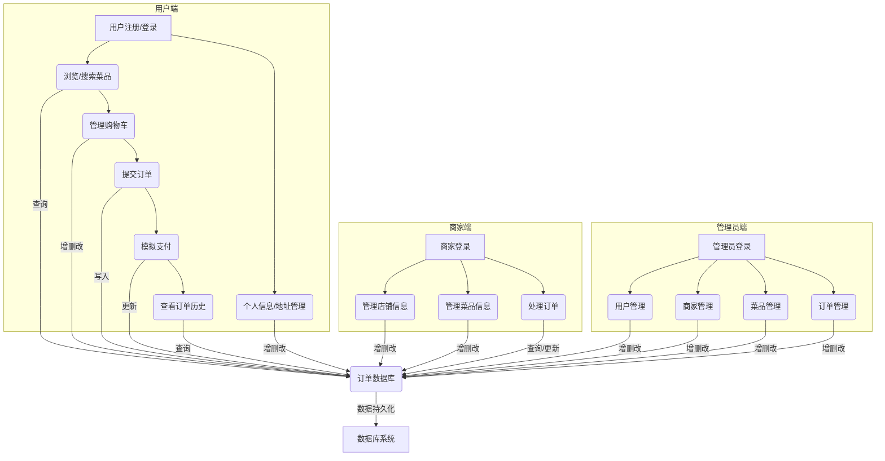
```mermaid
graph TD
    subgraph 用户端
        A[用户注册/登录] --> B(浏览/搜索菜品)
        B --> C(管理购物车)
        C --> D(提交订单)
        D --> E(模拟支付)
        E --> F(查看订单历史)
        A --> G(个人信息/地址管理)
    end

    subgraph 商家端
        H[商家登录] --> I(管理店铺信息)
        H --> J(管理菜品信息)
        H --> K(处理订单)
    end

    subgraph 管理员端
        L[管理员登录] --> M(用户管理)
        L --> N(商家管理)
        L --> O(菜品管理)
        L --> P(订单管理)
    end

    B -- 查询 --> Q(菜品数据库)
    C -- 增删改 --> Q
    D -- 写入 --> Q
    E -- 更新 --> Q
    F -- 查询 --> Q
    G -- 增删改 --> Q

    I -- 增删改 --> Q(商家数据库)
    J -- 增删改 --> Q(菜品数据库)
    K -- 查询/更新 --> Q(订单数据库)

    M -- 增删改 --> Q(用户数据库)
    N -- 增删改 --> Q(商家数据库)
    O -- 增删改 --> Q(菜品数据库)
    P -- 增删改 --> Q(订单数据库)

    Q -- 数据持久化 --> R[数据库系统]
```

### 5.3 系统数据流图

系统数据流图（Data Flow Diagram, DFD）从数据传输和处理的角度描述了系统。它展示了数据如何在系统内部流动，以及不同的处理过程如何转换这些数据。本节将提供一个高层次的系统数据流图。

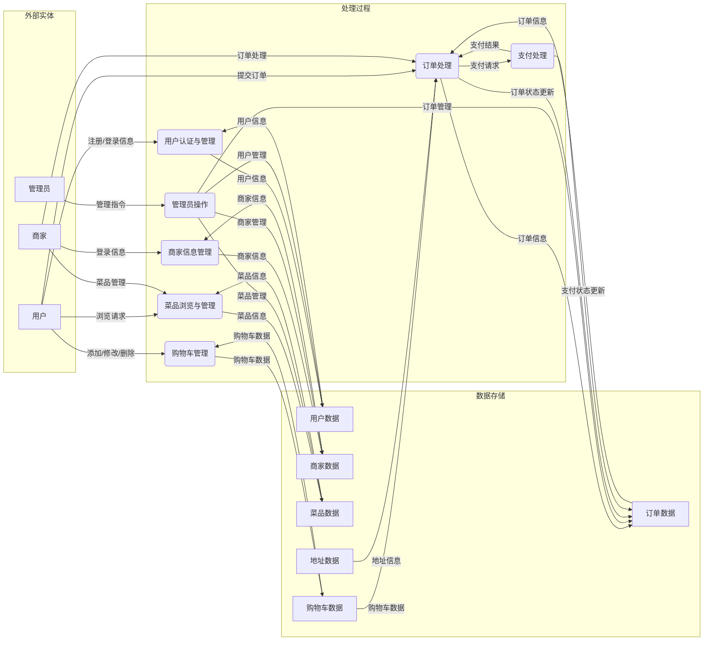
```mermaid
graph LR
    subgraph 外部实体
        User[用户]
        Merchant[商家]
        Admin[管理员]
    end

    subgraph 处理过程
        P1(用户认证与管理)
        P2(菜品浏览与管理)
        P3(购物车管理)
        P4(订单处理)
        P5(支付处理)
        P6(商家信息管理)
        P7(管理员操作)
    end

    subgraph 数据存储
        D1[用户数据]
        D2[商家数据]
        D3[菜品数据]
        D4[购物车数据]
        D5[订单数据]
        D6[地址数据]
    end

    User -- 注册/登录信息 --> P1
    P1 -- 用户信息 --> D1
    D1 -- 用户信息 --> P1

    User -- 浏览请求 --> P2
    P2 -- 菜品信息 --> D3
    D3 -- 菜品信息 --> P2

    User -- 添加/修改/删除 --> P3
    P3 -- 购物车数据 --> D4
    D4 -- 购物车数据 --> P3

    User -- 提交订单 --> P4
    P4 -- 订单信息 --> D5
    D4 -- 购物车数据 --> P4
    D6 -- 地址信息 --> P4
    D5 -- 订单信息 --> P4

    P4 -- 支付请求 --> P5
    P5 -- 支付结果 --> P4

    Merchant -- 登录信息 --> P6
    P6 -- 商家信息 --> D2
    D2 -- 商家信息 --> P6
    Merchant -- 菜品管理 --> P2
    Merchant -- 订单处理 --> P4

    Admin -- 管理指令 --> P7
    P7 -- 用户管理 --> D1
    P7 -- 商家管理 --> D2
    P7 -- 菜品管理 --> D3
    P7 -- 订单管理 --> D5

    P4 -- 订单状态更新 --> D5
    P5 -- 支付状态更新 --> D5
```

## 6. 详细设计

### 6.1 登录注册模块详细设计

登录注册模块是用户进入系统的第一步，负责用户身份的验证和新用户的创建。它确保了系统的安全性，并为用户提供个性化服务的基础。本模块主要包括用户注册、用户登录、密码找回（可选）和会话管理等功能。

#### 6.1.1 模块内处理流程

**用户注册流程：**

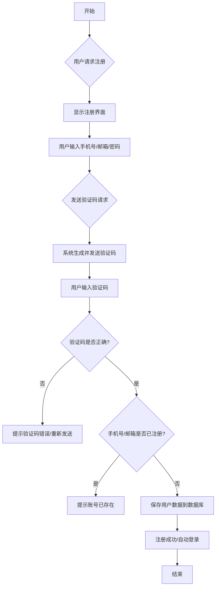
```mermaid
flowchart TD
    A[开始] --> B{用户请求注册}
    B --> C[显示注册界面]
    C --> D[用户输入手机号/邮箱/密码]
    D --> E{发送验证码请求}
    E --> F[系统生成并发送验证码]
    F --> G[用户输入验证码]
    G --> H{验证码是否正确?}
    H -- 否 --> I[提示验证码错误/重新发送]
    H -- 是 --> J{手机号/邮箱是否已注册?}
    J -- 是 --> K[提示账号已存在]
    J -- 否 --> L[保存用户数据到数据库]
    L --> M[注册成功/自动登录]
    M --> N[结束]
```

**用户登录流程：**

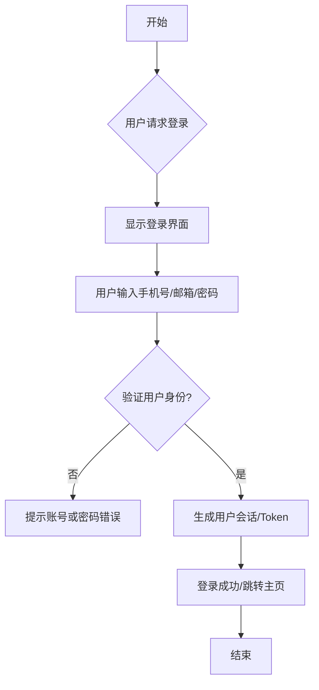
```mermaid
flowchart TD
    A[开始] --> B{用户请求登录}
    B --> C[显示登录界面]
    C --> D[用户输入手机号/邮箱/密码]
    D --> E{验证用户身份?}
    E -- 否 --> F[提示账号或密码错误]
    E -- 是 --> G[生成用户会话/Token]
    G --> H[登录成功/跳转主页]
    H --> I[结束]
```

#### 6.1.2 模块类图

登录注册模块涉及的主要类包括用户实体类、用户服务类、用户控制器类以及相关的验证工具类。

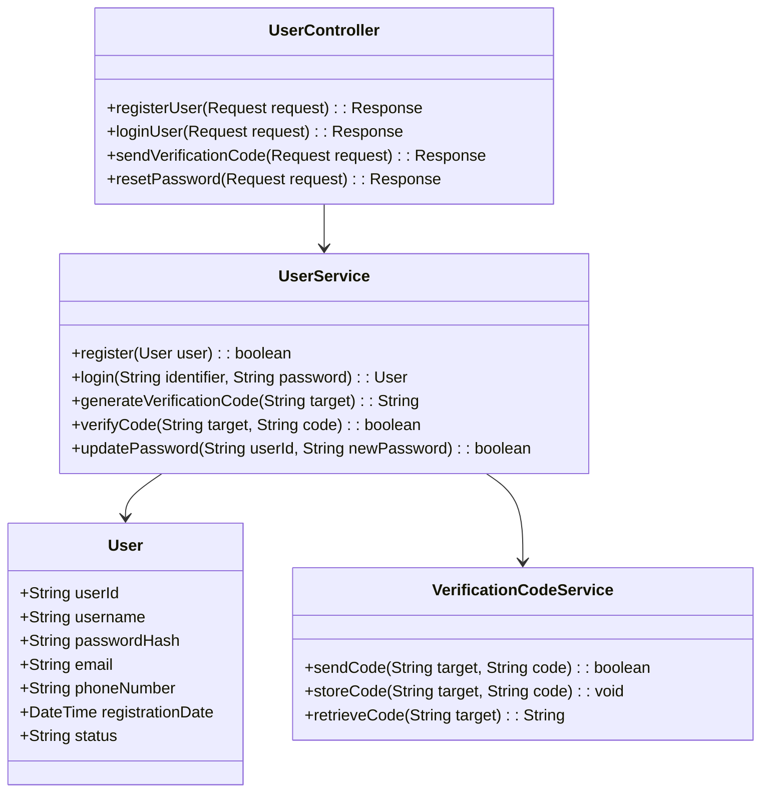
```mermaid
classDiagram
    class User {
        +String userId
        +String username
        +String passwordHash
        +String email
        +String phoneNumber
        +DateTime registrationDate
        +String status
    }

    class UserService {
        +register(User user): boolean
        +login(String identifier, String password): User
        +generateVerificationCode(String target): String
        +verifyCode(String target, String code): boolean
        +updatePassword(String userId, String newPassword): boolean
    }

    class UserController {
        +registerUser(Request request): Response
        +loginUser(Request request): Response
        +sendVerificationCode(Request request): Response
        +resetPassword(Request request): Response
    }

    class VerificationCodeService {
        +sendCode(String target, String code): boolean
        +storeCode(String target, String code): void
        +retrieveCode(String target): String
    }

    UserController --> UserService
    UserService --> User
    UserService --> VerificationCodeService
```

#### 6.1.3 模块数据流

登录注册模块的数据流主要描述了数据在用户界面、应用服务和数据库之间的传输。

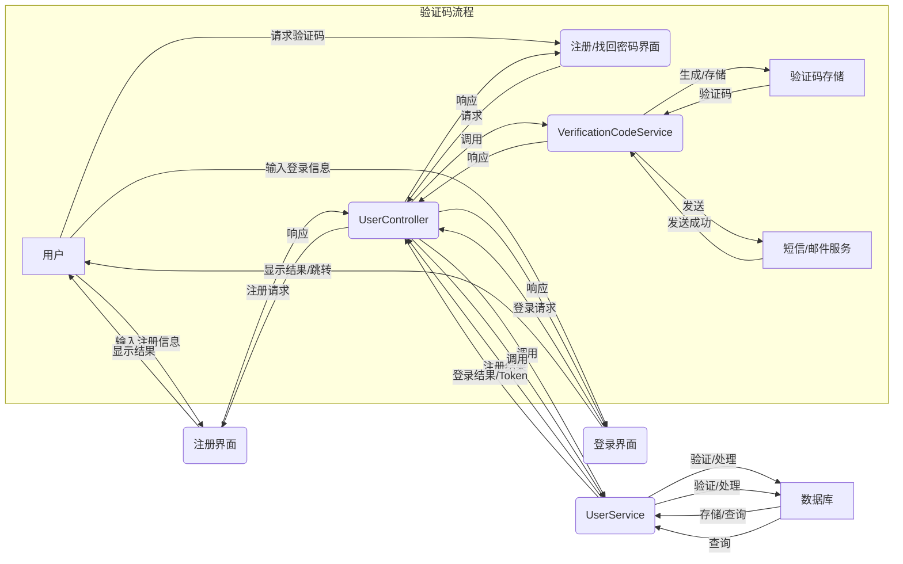
```mermaid
graph LR
    User[用户] -- 输入注册信息 --> UI(注册界面)
    UI -- 注册请求 --> Controller(UserController)
    Controller -- 调用 --> Service(UserService)
    Service -- 验证/处理 --> DB[数据库]
    DB -- 存储/查询 --> Service
    Service -- 注册结果 --> Controller
    Controller -- 响应 --> UI
    UI -- 显示结果 --> User

    User -- 输入登录信息 --> UI_Login(登录界面)
    UI_Login -- 登录请求 --> Controller
    Controller -- 调用 --> Service
    Service -- 验证/处理 --> DB
    DB -- 查询 --> Service
    Service -- 登录结果/Token --> Controller
    Controller -- 响应 --> UI_Login
    UI_Login -- 显示结果/跳转 --> User

    subgraph 验证码流程
        User -- 请求验证码 --> UI_Reg(注册/找回密码界面)
        UI_Reg -- 请求 --> Controller
        Controller -- 调用 --> VerificationCodeService(VerificationCodeService)
        VerificationCodeService -- 生成/存储 --> DB_Code[验证码存储]
        DB_Code -- 验证码 --> VerificationCodeService
        VerificationCodeService -- 发送 --> SMS_Email[短信/邮件服务]
        SMS_Email -- 发送成功 --> VerificationCodeService
        VerificationCodeService -- 响应 --> Controller
        Controller -- 响应 --> UI_Reg
    end
```

#### 6.1.4 算法描述

**用户密码加密算法：**

为了保障用户密码的安全性，系统在存储用户密码时，不会存储明文密码，而是存储密码的哈希值。推荐使用加盐（Salt）的哈希算法，如 bcrypt 或 PBKDF2。

1.  **注册时：**
    *   当用户提交注册信息时，系统会为每个用户生成一个唯一的随机盐值（Salt）。
    *   将用户输入的明文密码与该盐值进行拼接。
    *   对拼接后的字符串执行哈希算法（如 bcrypt），生成密码哈希值。
    *   将生成的盐值和密码哈希值一同存储到数据库中。

2.  **登录时：**
    *   当用户提交登录信息时，系统根据用户名或手机号从数据库中检索出对应的盐值和密码哈希值。
    *   将用户输入的明文密码与检索到的盐值进行拼接。
    *   对拼接后的字符串执行相同的哈希算法，生成新的哈希值。
    *   比较新生成的哈希值与数据库中存储的密码哈希值。如果两者一致，则认证成功；否则，认证失败。

**验证码生成与验证算法：**

1.  **生成：**
    *   系统生成一个指定长度（如6位）的随机数字或字母数字组合作为验证码。
    *   将验证码与目标（手机号或邮箱）以及生成时间戳一同存储到缓存（如 Redis）中，并设置一个过期时间（如5分钟）。

2.  **验证：**
    *   用户提交验证码后，系统根据目标（手机号或邮箱）从缓存中检索存储的验证码和生成时间戳。
    *   检查验证码是否过期。如果过期，则验证失败。
    *   比较用户输入的验证码与缓存中存储的验证码。如果一致，则验证成功并从缓存中删除该验证码；否则，验证失败。

#### 6.1.5 外部接口

登录注册模块需要与以下外部系统或服务进行交互：

*   **短信服务提供商 (SMS Service Provider)：** 用于发送手机验证码。系统通过调用短信服务提供商的API接口，将验证码发送到用户指定的手机号码。
*   **邮件服务提供商 (Email Service Provider)：** 用于发送邮箱验证码或注册成功通知。系统通过调用邮件服务提供商的API接口，将邮件发送到用户指定的邮箱地址。
*   **第三方认证服务 (Optional)：** 如果系统支持第三方登录（如微信、QQ、支付宝等），则需要与相应的第三方认证平台进行接口对接，实现OAuth或OpenID Connect协议进行用户身份验证。

这些外部接口的调用需要遵循各自服务提供商的API规范，并进行相应的安全认证（如API Key、Secret等）。

### 6.2 用户端菜品与订单管理模块详细设计

用户端菜品与订单管理模块是用户与外卖平台核心业务交互的枢纽，涵盖了用户从浏览、选择菜品到下单、支付、以及后续订单管理的全过程。本模块旨在提供流畅、直观的用户体验，确保用户能够便捷地完成外卖订购。

#### 6.2.1 模块界面

用户端菜品与订单管理模块的界面主要包括以下几个部分：

1.  **主页/菜品列表页：**
    *   **顶部搜索栏：** 允许用户输入关键词搜索菜品或餐厅。
    *   **分类导航：** 展示菜品分类（如中餐、西餐、小吃、饮品等），用户可点击切换。
    *   **筛选/排序选项：** 提供按销量、价格、评价、距离等进行筛选和排序的功能。
    *   **餐厅/菜品卡片列表：** 以卡片形式展示餐厅或菜品信息，包括图片、名称、价格、销量、评分等。
    *   **底部导航栏：** 包含“首页”、“订单”、“购物车”、“我的”等主要入口。

2.  **菜品详情页：**
    *   **菜品大图：** 清晰展示菜品图片。
    *   **菜品名称、价格、描述：** 详细介绍菜品信息。
    *   **评价/销量信息：** 展示菜品的累计销量和用户评价概览。
    *   **数量选择器：** 允许用户选择购买数量。
    *   **“加入购物车”按钮：** 将选定菜品添加到购物车。

3.  **购物车页面：**
    *   **菜品列表：** 展示已加入购物车的菜品，包括菜品名称、单价、数量。
    *   **数量修改器：** 允许用户增减购物车中菜品的数量。
    *   **删除按钮：** 移除购物车中的菜品。
    *   **清空购物车按钮：** 一键清空所有菜品。
    *   **总价显示：** 实时计算并显示所有菜品的总价。
    *   **“去结算”按钮：** 引导用户进入订单确认页面。

4.  **订单确认页面：**
    *   **订单概览：** 再次确认所选菜品列表、数量和总价。
    *   **配送地址选择/新增：** 展示用户已有的地址列表，并提供新增地址的入口。
    *   **配送时间选择：** 提供“立即配送”或“预约配送”选项。
    *   **订单备注输入框：** 允许用户添加特殊要求。
    *   **支付方式选择（可选）：** 如模拟支付。
    *   **“提交订单”按钮：** 最终确认并提交订单。

5.  **模拟支付页面：**
    *   **订单金额显示：** 明确告知用户需支付的金额。
    *   **“模拟支付成功”按钮：** 模拟支付成功的场景。
    *   **“模拟支付失败”按钮：** 模拟支付失败的场景。

6.  **订单历史页面：**
    *   **订单列表：** 展示用户所有历史订单，包括订单号、下单时间、总金额、当前状态。
    *   **状态筛选：** 允许用户按订单状态（如待支付、待接单、配送中、已完成、已取消）进行筛选。
    *   **订单详情入口：** 点击订单可查看详细信息。

7.  **订单详情页面：**
    *   **订单基本信息：** 订单号、下单时间、支付状态、当前状态。
    *   **菜品清单：** 订单中包含的菜品列表、数量、单价。
    *   **配送信息：** 收货地址、联系人、联系电话、预计送达时间。
    *   **支付信息：** 支付金额、支付方式。
    *   **操作按钮：** 根据订单状态提供不同操作，如“取消订单”（待支付）、“再次购买”（已完成）。

#### 6.2.2 模块内处理流程

**1. 菜品浏览与搜索流程：**

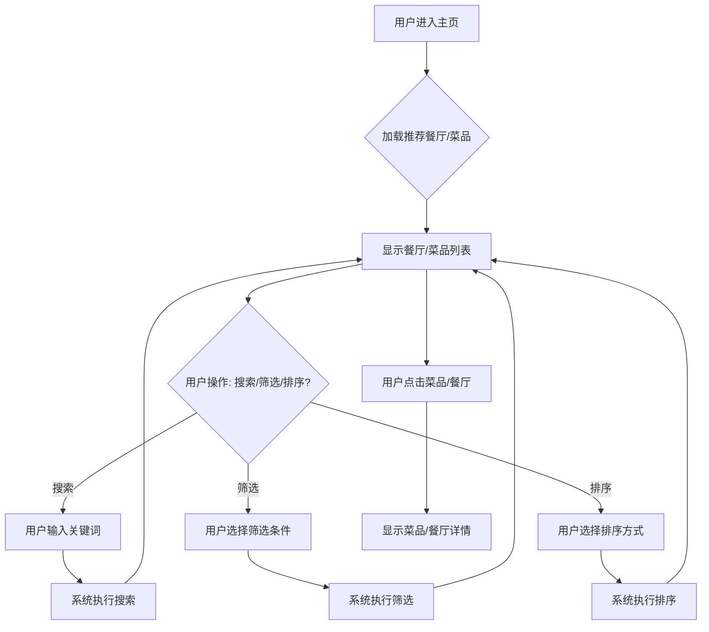
```mermaid
flowchart TD
    A[用户进入主页] --> B{加载推荐餐厅/菜品}
    B --> C[显示餐厅/菜品列表]
    C --> D{用户操作: 搜索/筛选/排序?}
    D -- 搜索 --> E[用户输入关键词]
    E --> F[系统执行搜索]
    D -- 筛选 --> G[用户选择筛选条件]
    G --> H[系统执行筛选]
    D -- 排序 --> I[用户选择排序方式]
    I --> J[系统执行排序]
    F --> C
    H --> C
    J --> C
    C --> K[用户点击菜品/餐厅] --> L[显示菜品/餐厅详情]
```

**2. 购物车管理流程：**

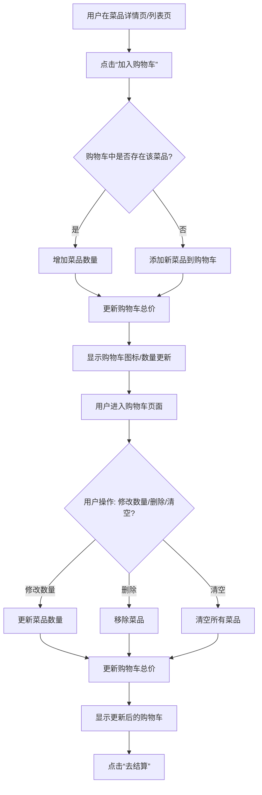
```mermaid
flowchart TD
    A[用户在菜品详情页/列表页] --> B[点击“加入购物车”]
    B --> C{购物车中是否存在该菜品?}
    C -- 是 --> D[增加菜品数量]
    C -- 否 --> E[添加新菜品到购物车]
    D --> F[更新购物车总价]
    E --> F
    F --> G[显示购物车图标/数量更新]
    G --> H[用户进入购物车页面]
    H --> I{用户操作: 修改数量/删除/清空?}
    I -- 修改数量 --> J[更新菜品数量]
    I -- 删除 --> K[移除菜品]
    I -- 清空 --> L[清空所有菜品]
    J --> M[更新购物车总价]
    K --> M
    L --> M
    M --> N[显示更新后的购物车]
    N --> O[点击“去结算”]
```

**3. 下单与支付流程：**

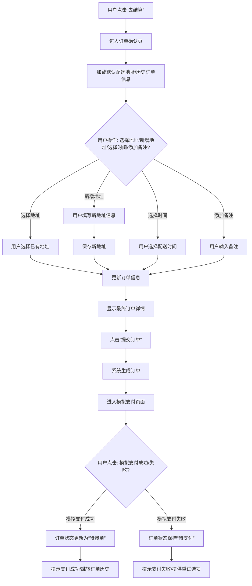
```mermaid
flowchart TD
    A[用户点击“去结算”] --> B[进入订单确认页]
    B --> C[加载默认配送地址/历史订单信息]
    C --> D{用户操作: 选择地址/新增地址/选择时间/添加备注?}
    D -- 选择地址 --> E[用户选择已有地址]
    D -- 新增地址 --> F[用户填写新地址信息]
    F --> G[保存新地址]
    D -- 选择时间 --> H[用户选择配送时间]
    D -- 添加备注 --> I[用户输入备注]
    E --> J[更新订单信息]
    G --> J
    H --> J
    I --> J
    J --> K[显示最终订单详情]
    K --> L[点击“提交订单”]
    L --> M[系统生成订单]
    M --> N[进入模拟支付页面]
    N --> O{用户点击: 模拟支付成功/失败?}
    O -- 模拟支付成功 --> P[订单状态更新为“待接单”]
    P --> Q[提示支付成功/跳转订单历史]
    O -- 模拟支付失败 --> R[订单状态保持“待支付”]
    R --> S[提示支付失败/提供重试选项]
```

**4. 订单历史与详情流程：**

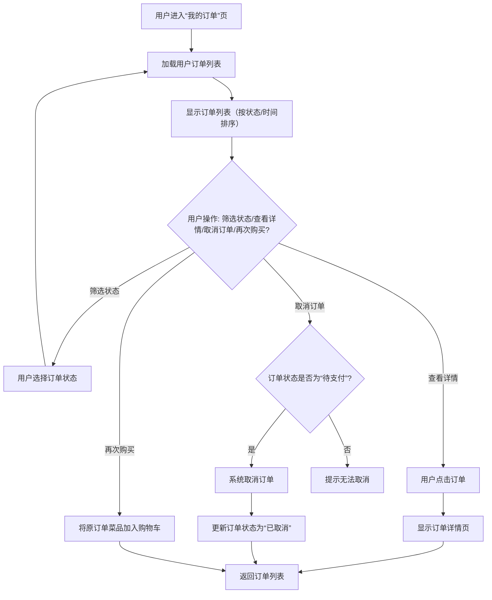
```mermaid
flowchart TD
    A[用户进入“我的订单”页] --> B[加载用户订单列表]
    B --> C[显示订单列表（按状态/时间排序）]
    C --> D{用户操作: 筛选状态/查看详情/取消订单/再次购买?}
    D -- 筛选状态 --> E[用户选择订单状态]
    E --> B
    D -- 查看详情 --> F[用户点击订单]
    F --> G[显示订单详情页]
    D -- 取消订单 --> H{订单状态是否为“待支付”?}
    H -- 是 --> I[系统取消订单]
    H -- 否 --> J[提示无法取消]
    I --> K[更新订单状态为“已取消”]
    D -- 再次购买 --> L[将原订单菜品加入购物车]
    G --> M[返回订单列表]
    K --> M
    L --> M
```

#### 6.2.3 模块类图

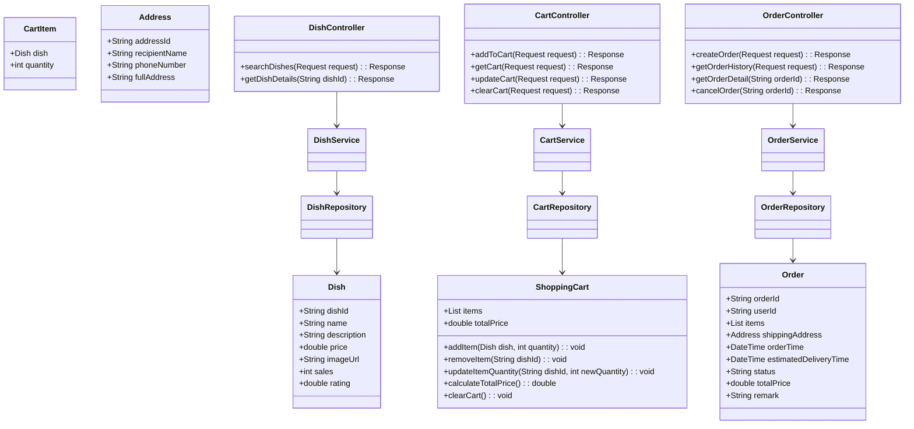
```mermaid
classDiagram
    class Dish {
        +String dishId
        +String name
        +String description
        +double price
        +String imageUrl
        +int sales
        +double rating
    }

    class CartItem {
        +Dish dish
        +int quantity
    }

    class ShoppingCart {
        +List<CartItem> items
        +double totalPrice
        +addItem(Dish dish, int quantity): void
        +removeItem(String dishId): void
        +updateItemQuantity(String dishId, int newQuantity): void
        +calculateTotalPrice(): double
        +clearCart(): void
    }

    class Order {
        +String orderId
        +String userId
        +List<CartItem> items
        +Address shippingAddress
        +DateTime orderTime
        +DateTime estimatedDeliveryTime
        +String status
        +double totalPrice
        +String remark
    }

    class Address {
        +String addressId
        +String recipientName
        +String phoneNumber
        +String fullAddress
    }

    class DishController {
        +searchDishes(Request request): Response
        +getDishDetails(String dishId): Response
    }

    class CartController {
        +addToCart(Request request): Response
        +getCart(Request request): Response
        +updateCart(Request request): Response
        +clearCart(Request request): Response
    }

    class OrderController {
        +createOrder(Request request): Response
        +getOrderHistory(Request request): Response
        +getOrderDetail(String orderId): Response
        +cancelOrder(String orderId): Response
    }

    DishController --> DishService
    CartController --> CartService
    OrderController --> OrderService

    DishService --> DishRepository
    CartService --> CartRepository
    OrderService --> OrderRepository

    DishRepository --> Dish
    CartRepository --> ShoppingCart
    OrderRepository --> Order
```

### 6.3 用户个人中心模块详细设计

用户个人中心模块为用户提供了一个管理个人信息、收货地址和查看历史订单的集中区域。它是用户个性化体验和便捷操作的重要组成部分。

#### 6.3.1 模块界面

用户个人中心模块的界面主要包括以下几个部分：

1.  **个人信息展示区：**
    *   显示用户头像、昵称、手机号/邮箱（部分隐藏）。
    *   提供“编辑资料”入口。

2.  **功能导航列表：**
    *   “我的订单”：点击进入订单历史页面。
    *   “收货地址”：点击进入地址簿管理页面。
    *   “修改密码”：点击进入密码修改页面。
    *   “关于我们”、“帮助中心”（可选）。
    *   “退出登录”按钮。

3.  **编辑资料页面：**
    *   允许用户上传/修改头像。
    *   输入框修改昵称、性别等。
    *   “保存”按钮。

4.  **地址簿管理页面：**
    *   列表展示所有已保存的收货地址，包括收货人、电话、详细地址。
    *   “新增地址”按钮。
    *   每个地址旁有“编辑”、“删除”按钮，并可设置“默认地址”。

5.  **修改密码页面：**
    *   输入框：旧密码、新密码、确认新密码。
    *   “保存”按钮。

#### 6.3.2 模块内处理流程

**1. 查看/编辑个人信息流程：**

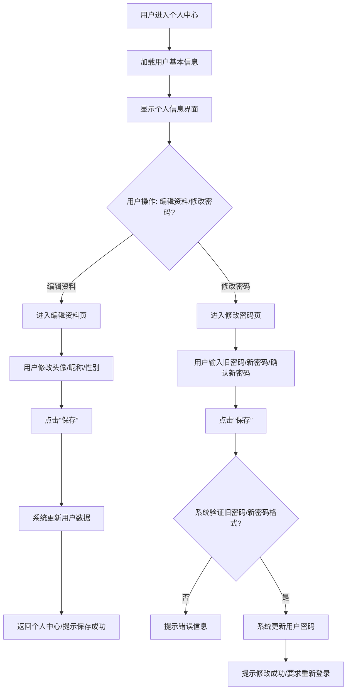
```mermaid
flowchart TD
    A[用户进入个人中心] --> B[加载用户基本信息]
    B --> C[显示个人信息界面]
    C --> D{用户操作: 编辑资料/修改密码?}
    D -- 编辑资料 --> E[进入编辑资料页]
    E --> F[用户修改头像/昵称/性别]
    F --> G[点击“保存”]
    G --> H[系统更新用户数据]
    H --> I[返回个人中心/提示保存成功]
    D -- 修改密码 --> J[进入修改密码页]
    J --> K[用户输入旧密码/新密码/确认新密码]
    K --> L[点击“保存”]
    L --> M{系统验证旧密码/新密码格式?}
    M -- 否 --> N[提示错误信息]
    M -- 是 --> O[系统更新用户密码]
    O --> P[提示修改成功/要求重新登录]
```

**2. 地址簿管理流程：**

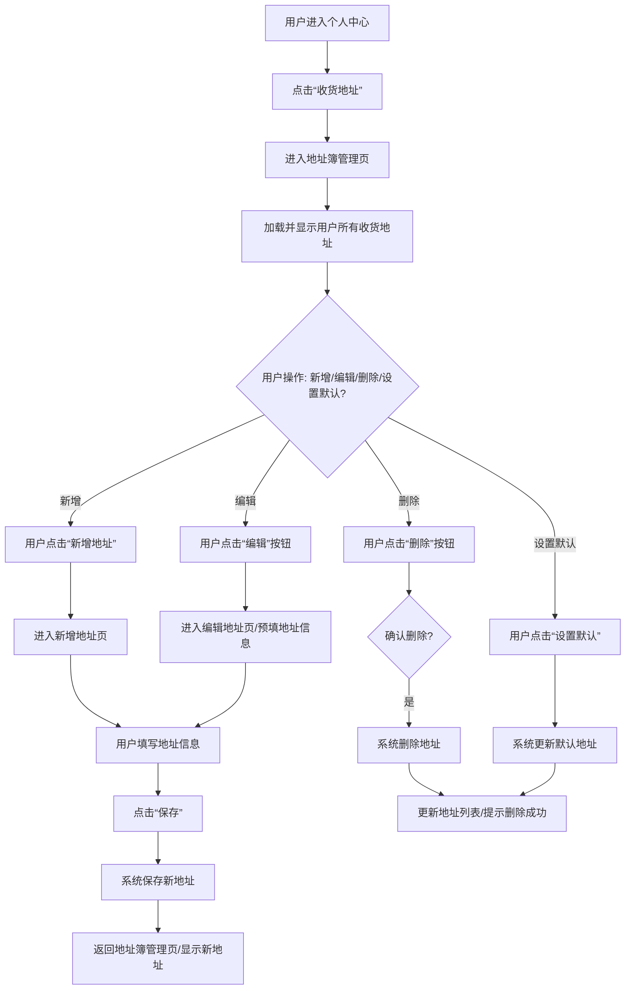
```mermaid
flowchart TD
    A[用户进入个人中心] --> B[点击“收货地址”]
    B --> C[进入地址簿管理页]
    C --> D[加载并显示用户所有收货地址]
    D --> E{用户操作: 新增/编辑/删除/设置默认?}
    E -- 新增 --> F[用户点击“新增地址”]
    F --> G[进入新增地址页]
    G --> H[用户填写地址信息]
    H --> I[点击“保存”]
    I --> J[系统保存新地址]
    J --> K[返回地址簿管理页/显示新地址]
    E -- 编辑 --> L[用户点击“编辑”按钮]
    L --> M[进入编辑地址页/预填地址信息]
    M --> H
    E -- 删除 --> N[用户点击“删除”按钮]
    N --> O{确认删除?}
    O -- 是 --> P[系统删除地址]
    P --> Q[更新地址列表/提示删除成功]
    E -- 设置默认 --> R[用户点击“设置默认”]
    R --> S[系统更新默认地址]
    S --> Q
```

#### 6.3.3 模块类图

用户个人中心模块涉及的主要类包括用户实体类、地址实体类、用户服务类和用户控制器类。

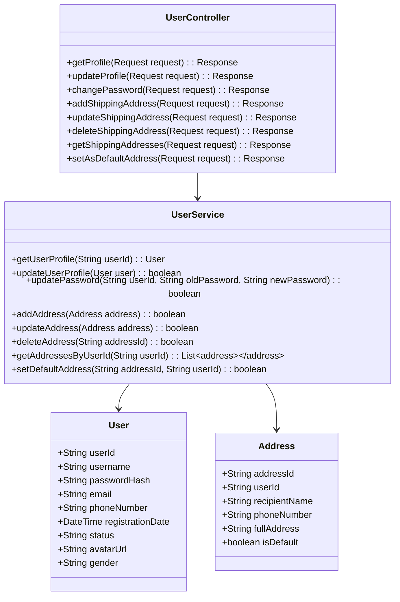
```mermaid
classDiagram
    class User {
        +String userId
        +String username
        +String passwordHash
        +String email
        +String phoneNumber
        +DateTime registrationDate
        +String status
        +String avatarUrl
        +String gender
    }

    class Address {
        +String addressId
        +String userId
        +String recipientName
        +String phoneNumber
        +String fullAddress
        +boolean isDefault
    }

    class UserService {
        +getUserProfile(String userId): User
        +updateUserProfile(User user): boolean
        +updatePassword(String userId, String oldPassword, String newPassword): boolean
        +addAddress(Address address): boolean
        +updateAddress(Address address): boolean
        +deleteAddress(String addressId): boolean
        +getAddressesByUserId(String userId): List<Address>
        +setDefaultAddress(String addressId, String userId): boolean
    }

    class UserController {
        +getProfile(Request request): Response
        +updateProfile(Request request): Response
        +changePassword(Request request): Response
        +addShippingAddress(Request request): Response
        +updateShippingAddress(Request request): Response
        +deleteShippingAddress(Request request): Response
        +getShippingAddresses(Request request): Response
        +setAsDefaultAddress(Request request): Response
    }

    UserController --> UserService
    UserService --> User
    UserService --> Address
```

#### 6.3.4 模块数据流

用户个人中心模块的数据流主要描述了用户个人信息和地址簿数据在前端界面、应用服务和数据库之间的传输。

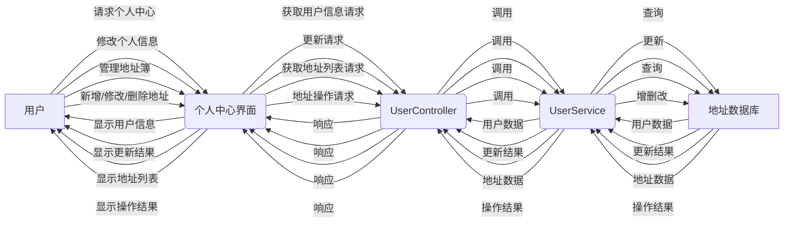
```mermaid
graph LR
    User[用户] -- 请求个人中心 --> UI(个人中心界面)
    UI -- 获取用户信息请求 --> Controller(UserController)
    Controller -- 调用 --> Service(UserService)
    Service -- 查询 --> DB[用户数据库]
    DB -- 用户数据 --> Service
    Service -- 用户数据 --> Controller
    Controller -- 响应 --> UI
    UI -- 显示用户信息 --> User

    User -- 修改个人信息 --> UI
    UI -- 更新请求 --> Controller
    Controller -- 调用 --> Service
    Service -- 更新 --> DB
    DB -- 更新结果 --> Service
    Service -- 更新结果 --> Controller
    Controller -- 响应 --> UI
    UI -- 显示更新结果 --> User

    User -- 管理地址簿 --> UI
    UI -- 获取地址列表请求 --> Controller
    Controller -- 调用 --> Service
    Service -- 查询 --> DB[地址数据库]
    DB -- 地址数据 --> Service
    Service -- 地址数据 --> Controller
    Controller -- 响应 --> UI
    UI -- 显示地址列表 --> User

    User -- 新增/修改/删除地址 --> UI
    UI -- 地址操作请求 --> Controller
    Controller -- 调用 --> Service
    Service -- 增删改 --> DB
    DB -- 操作结果 --> Service
    Service -- 操作结果 --> Controller
    Controller -- 响应 --> UI
    UI -- 显示操作结果 --> User
```

#### 6.3.5 算法描述

**1. 密码修改算法：**

当用户修改密码时，系统需要执行以下步骤：

*   **旧密码验证：** 获取用户输入的旧密码，并与数据库中存储的该用户的密码哈希值进行比对。此过程与登录时的密码验证算法相同，即对旧密码加盐哈希后与数据库中的哈希值进行比较。如果旧密码不正确，则拒绝修改。
*   **新密码加密：** 如果旧密码验证通过，则对用户输入的新密码进行加盐哈希处理，生成新的密码哈希值。使用与注册时相同的密码加密算法。
*   **数据库更新：** 将新生成的密码哈希值更新到数据库中该用户的密码字段。

**2. 默认地址设置算法：**

当用户设置某个地址为默认地址时，系统需要确保每个用户只有一个默认地址。算法如下：

*   **取消旧默认：** 查询该用户当前所有的地址，找到标记为默认地址的记录（如果存在）。将其`isDefault`字段更新为`false`。
*   **设置新默认：** 将用户指定的新默认地址的`isDefault`字段更新为`true`。
*   **原子性操作：** 这两个更新操作应在一个事务中完成，以确保数据的一致性。如果其中任何一个操作失败，则整个事务回滚，保证默认地址的唯一性。

#### 6.3.6 外部接口

用户个人中心模块主要与内部的用户管理服务和数据库进行交互，通常不直接涉及外部第三方接口。但如果系统集成了以下功能，则可能需要：

*   **图片存储服务：** 如果用户头像支持上传到云存储（如阿里云OSS、腾讯云COS、AWS S3等），则需要调用相应云服务的API进行图片上传和管理。
*   **地理位置服务：** 如果地址簿管理需要地址解析、地理编码或地图展示功能，可能需要调用地图服务提供商（如高德地图API、百度地图API、Google Maps API）的接口。

### 6.4 商家端模块详细设计

商家端模块是为入驻外卖平台的商家提供的管理后台，旨在帮助商家高效管理店铺信息、菜品信息以及处理用户订单。本模块是商家日常运营的核心工具，其设计应注重操作的便捷性、功能的完整性和数据的实时性。

#### 6.4.1 模块界面

商家端模块的界面主要包括以下几个部分：

1.  **登录界面：**
    *   商家专属的登录入口，输入账号（手机号/邮箱/商家ID）和密码。
    *   “登录”按钮。

2.  **商家后台主页/仪表盘：**
    *   **顶部导航栏：** 包含店铺名称、商家ID、退出登录等。
    *   **侧边导航栏：** 主要功能模块入口，如“店铺管理”、“菜品管理”、“订单管理”、“数据统计”（可选）等。
    *   **核心数据概览：** 仪表盘区域展示今日订单量、待处理订单数、营业额概览等关键数据。

3.  **店铺管理界面：**
    *   **基本信息：** 店铺名称、店铺Logo、店铺介绍、联系电话、营业时间、店铺地址等。
    *   **营业状态：** 开关按钮，用于设置店铺为“营业中”或“休息中”。
    *   “保存”按钮，用于更新店铺信息。

4.  **菜品管理界面：**
    *   **菜品列表：** 以表格形式展示所有菜品，包括菜品图片、名称、分类、价格、销量、状态（上架/下架）。
    *   **搜索/筛选：** 允许按菜品名称、分类、状态进行搜索和筛选。
    *   **“新增菜品”按钮：** 进入新增菜品页面。
    *   每行菜品提供“编辑”、“上架/下架”、“删除”操作按钮。
    *   **菜品分类管理入口：** 链接到菜品分类管理页面。

5.  **新增/编辑菜品界面：**
    *   **菜品名称、描述、价格、库存：** 输入框。
    *   **菜品分类选择：** 下拉菜单选择所属分类。
    *   **菜品图片上传：** 图片上传组件，支持预览。
    *   **菜品状态：** 开关按钮，设置菜品是否上架。
    *   “保存”按钮。

6.  **菜品分类管理界面：**
    *   **分类列表：** 展示所有菜品分类，包括分类名称、排序。
    *   **“新增分类”按钮：** 输入分类名称。
    *   每行分类提供“编辑”、“删除”操作按钮。

7.  **订单管理界面：**
    *   **订单列表：** 以表格形式展示订单，包括订单号、下单时间、用户昵称、总金额、订单状态。
    *   **状态筛选：** 允许按订单状态（如待接单、配送中、已完成、已取消）进行筛选。
    *   每行订单提供“查看详情”、“接单”、“拒绝接单”操作按钮（根据订单状态动态显示）。

8.  **订单详情界面：**
    *   **订单基本信息：** 订单号、下单时间、总金额、当前状态。
    *   **菜品清单：** 订单中包含的菜品列表、数量、单价。
    *   **用户信息：** 用户昵称、联系电话、配送地址。
    *   **操作按钮：** 如“接单”、“拒绝接单”、“完成配送”（可选）。

#### 6.4.2 模块内处理流程

**1. 商家登录流程：**

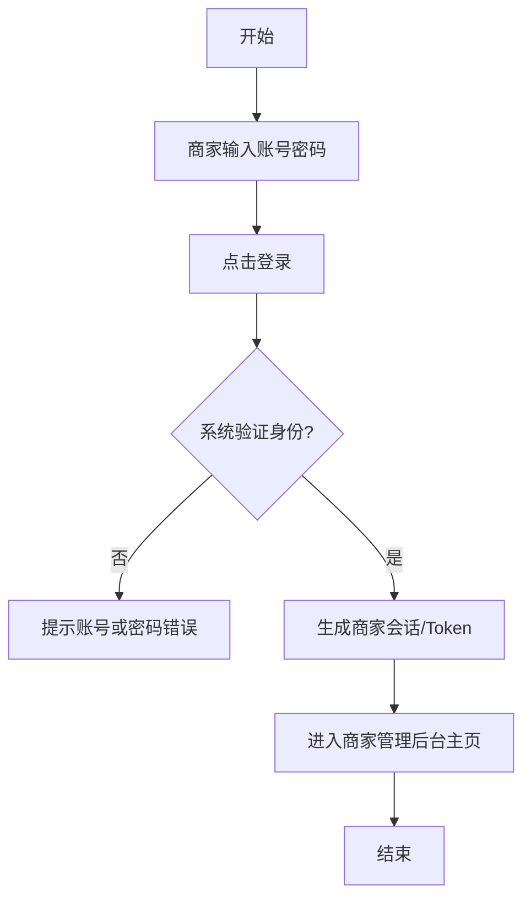
```mermaid
flowchart TD
    A[开始] --> B[商家输入账号密码]
    B --> C[点击登录]
    C --> D{系统验证身份?}
    D -- 否 --> E[提示账号或密码错误]
    D -- 是 --> F[生成商家会话/Token]
    F --> G[进入商家管理后台主页]
    G --> H[结束]
```

**2. 店铺信息管理流程：**

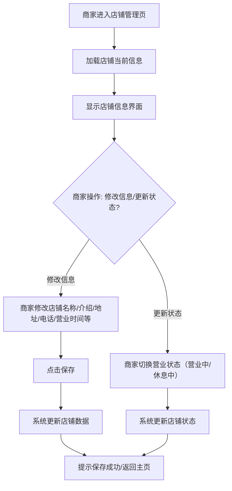
```mermaid
flowchart TD
    A[商家进入店铺管理页] --> B[加载店铺当前信息]
    B --> C[显示店铺信息界面]
    C --> D{商家操作: 修改信息/更新状态?}
    D -- 修改信息 --> E[商家修改店铺名称/介绍/地址/电话/营业时间等]
    E --> F[点击保存]
    F --> G[系统更新店铺数据]
    D -- 更新状态 --> H[商家切换营业状态（营业中/休息中）]
    H --> I[系统更新店铺状态]
    G --> J[提示保存成功/返回主页]
    I --> J
```

**3. 菜品信息管理流程：**

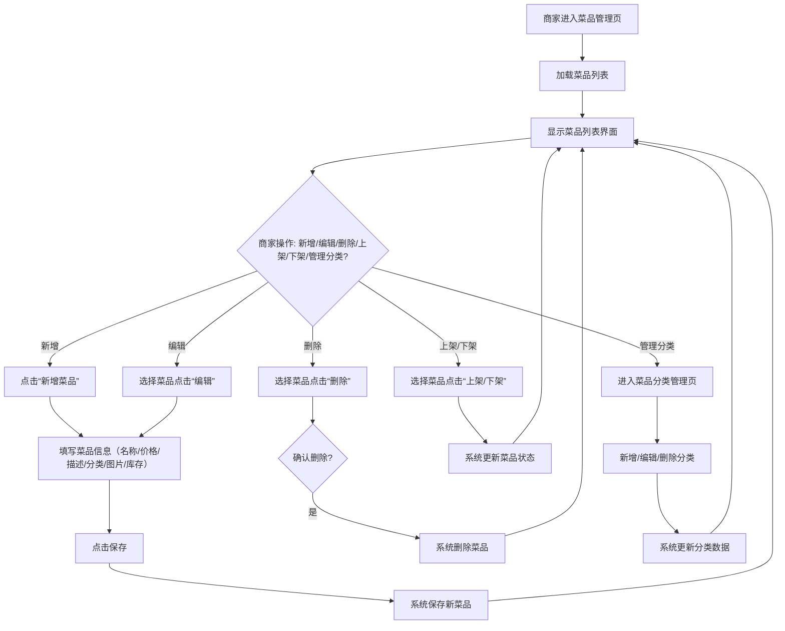
```mermaid
flowchart TD
    A[商家进入菜品管理页] --> B[加载菜品列表]
    B --> C[显示菜品列表界面]
    C --> D{商家操作: 新增/编辑/删除/上架/下架/管理分类?}
    D -- 新增 --> E[点击“新增菜品”]
    E --> F[填写菜品信息（名称/价格/描述/分类/图片/库存）]
    F --> G[点击保存]
    G --> H[系统保存新菜品]
    D -- 编辑 --> I[选择菜品点击“编辑”]
    I --> F
    D -- 删除 --> J[选择菜品点击“删除”]
    J --> K{确认删除?}
    K -- 是 --> L[系统删除菜品]
    D -- 上架/下架 --> M[选择菜品点击“上架/下架”]
    M --> N[系统更新菜品状态]
    D -- 管理分类 --> O[进入菜品分类管理页]
    O --> P[新增/编辑/删除分类]
    P --> Q[系统更新分类数据]
    H --> C
    L --> C
    N --> C
    Q --> C
```

**4. 订单处理流程：**

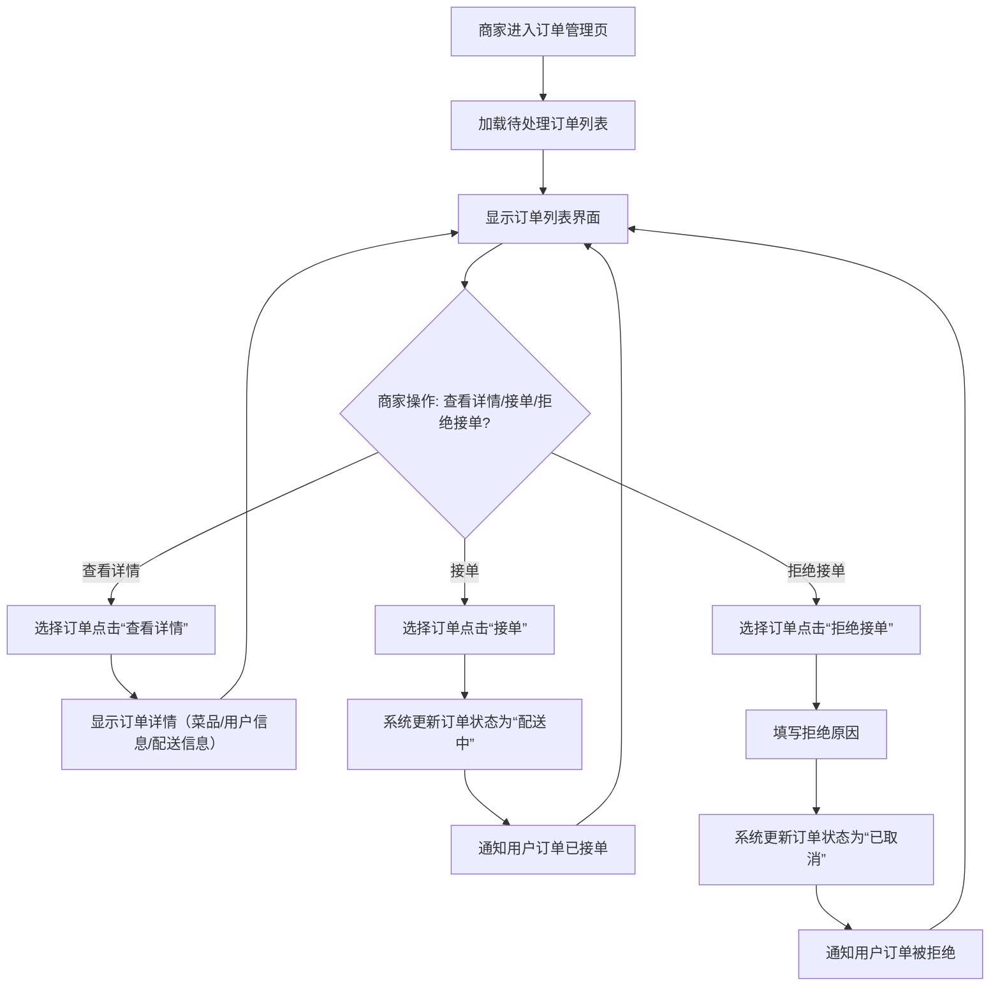
```mermaid
flowchart TD
    A[商家进入订单管理页] --> B[加载待处理订单列表]
    B --> C[显示订单列表界面]
    C --> D{商家操作: 查看详情/接单/拒绝接单?}
    D -- 查看详情 --> E[选择订单点击“查看详情”]
    E --> F[显示订单详情（菜品/用户信息/配送信息）]
    D -- 接单 --> G[选择订单点击“接单”]
    G --> H[系统更新订单状态为“配送中”]
    H --> I[通知用户订单已接单]
    D -- 拒绝接单 --> J[选择订单点击“拒绝接单”]
    J --> K[填写拒绝原因]
    K --> L[系统更新订单状态为“已取消”]
    L --> M[通知用户订单被拒绝]
    F --> C
    I --> C
    M --> C
```

#### 6.4.3 模块类图

商家端模块涉及的主要类包括商家实体类、菜品实体类、订单实体类以及相关的服务和控制器类。

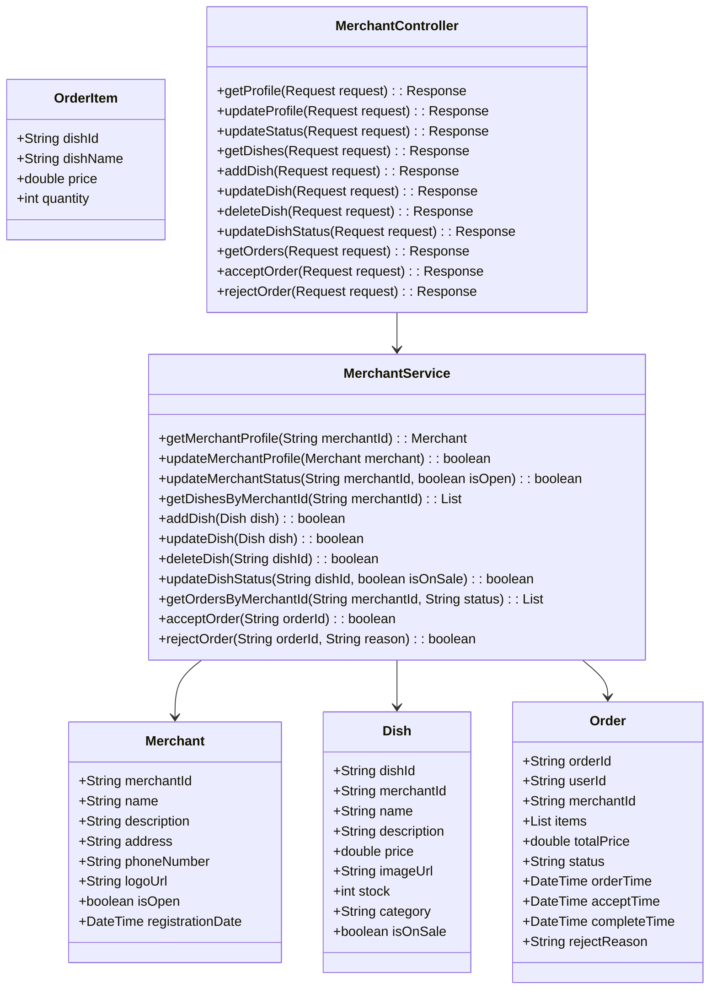
```mermaid
classDiagram
    class Merchant {
        +String merchantId
        +String name
        +String description
        +String address
        +String phoneNumber
        +String logoUrl
        +boolean isOpen
        +DateTime registrationDate
    }

    class Dish {
        +String dishId
        +String merchantId
        +String name
        +String description
        +double price
        +String imageUrl
        +int stock
        +String category
        +boolean isOnSale
    }

    class Order {
        +String orderId
        +String userId
        +String merchantId
        +List<OrderItem> items
        +double totalPrice
        +String status
        +DateTime orderTime
        +DateTime acceptTime
        +DateTime completeTime
        +String rejectReason
    }

    class OrderItem {
        +String dishId
        +String dishName
        +double price
        +int quantity
    }

    class MerchantService {
        +getMerchantProfile(String merchantId): Merchant
        +updateMerchantProfile(Merchant merchant): boolean
        +updateMerchantStatus(String merchantId, boolean isOpen): boolean
        +getDishesByMerchantId(String merchantId): List<Dish>
        +addDish(Dish dish): boolean
        +updateDish(Dish dish): boolean
        +deleteDish(String dishId): boolean
        +updateDishStatus(String dishId, boolean isOnSale): boolean
        +getOrdersByMerchantId(String merchantId, String status): List<Order>
        +acceptOrder(String orderId): boolean
        +rejectOrder(String orderId, String reason): boolean
    }

    class MerchantController {
        +getProfile(Request request): Response
        +updateProfile(Request request): Response
        +updateStatus(Request request): Response
        +getDishes(Request request): Response
        +addDish(Request request): Response
        +updateDish(Request request): Response
        +deleteDish(Request request): Response
        +updateDishStatus(Request request): Response
        +getOrders(Request request): Response
        +acceptOrder(Request request): Response
        +rejectOrder(Request request): Response
    }

    MerchantController --> MerchantService
    MerchantService --> Merchant
    MerchantService --> Dish
    MerchantService --> Order
```

#### 6.4.4 模块数据流

商家端模块的数据流主要描述了数据在商家界面、应用服务和数据库之间的传输。

```mermaid
graph LR
    Merchant[商家] -- 登录信息 --> UI_Login(商家登录界面)
    UI_Login -- 登录请求 --> Controller(MerchantController)
    Controller -- 调用 --> Service(MerchantService)
    Service -- 验证/处理 --> DB[数据库]
    DB -- 存储/查询 --> Service
    Service -- 登录结果/Token --> Controller
    Controller -- 响应 --> UI_Dashboard(商家后台主页)
    UI_Dashboard -- 显示数据 --> Merchant

    Merchant -- 管理店铺信息 --> UI_Shop(店铺管理界面)
    UI_Shop -- 更新请求 --> Controller
    Controller -- 调用 --> Service
    Service -- 更新 --> DB
    DB -- 更新结果 --> Service
    Service -- 更新结果 --> Controller
    Controller -- 响应 --> UI_Shop
    UI_Shop -- 显示更新结果 --> Merchant

    Merchant -- 管理菜品信息 --> UI_Dish(菜品管理界面)
    UI_Dish -- 增删改查请求 --> Controller
    Controller -- 调用 --> Service
    Service -- 增删改查 --> DB
    DB -- 菜品数据 --> Service
    Service -- 菜品数据 --> Controller
    Controller -- 响应 --> UI_Dish
    UI_Dish -- 显示菜品列表/结果 --> Merchant

    Merchant -- 处理订单 --> UI_Order(订单管理界面)
    UI_Order -- 查询/操作请求 --> Controller
    Controller -- 调用 --> Service
    Service -- 查询/更新 --> DB
    DB -- 订单数据 --> Service
    Service -- 订单数据 --> Controller
    Controller -- 响应 --> UI_Order
    UI_Order -- 显示订单列表/结果 --> Merchant
```

#### 6.4.5 算法描述

**1. 菜品库存管理算法：**

当用户下单时，系统需要对菜品库存进行管理，以避免超卖。通常采用以下策略：

*   **预扣库存：** 在用户提交订单（进入支付环节）时，系统会尝试预扣除相应菜品的库存。如果库存不足，则订单提交失败并提示用户。
*   **支付成功后扣减：** 当订单支付成功后，系统正式扣减菜品库存。如果此时因并发等原因导致库存不足，则需要进行异常处理（如订单取消、退款）。
*   **事务管理：** 预扣库存和实际扣减库存的操作应在数据库事务中进行，确保数据的一致性。

**2. 订单状态流转算法：**

订单状态的流转是外卖平台的核心业务逻辑之一。系统需要根据用户和商家的操作，以及支付结果，自动或手动更新订单状态。

*   **待支付：** 用户提交订单后初始状态。
*   **待接单：** 用户支付成功后，订单状态变为待接单，等待商家处理。
*   **配送中：** 商家接单后，订单状态变为配送中。
*   **已完成：** 订单配送完成后，状态变为已完成。
*   **已取消：** 用户在待支付状态下取消订单，或商家拒绝接单，订单状态变为已取消。
*   **已退款：** 订单取消后，如果已支付，则进行退款流程，订单状态变为已退款。

系统需要维护一个订单状态机，确保状态流转的合法性，防止非法状态转换。

#### 6.4.6 外部接口

商家端模块主要与内部的用户服务、菜品服务和订单服务进行交互，通常不直接涉及外部第三方接口。但如果系统集成了以下功能，则可能需要：

*   **图片存储服务：** 商家上传菜品图片和店铺Logo时，可能需要调用云存储服务（如阿里云OSS、腾讯云COS、AWS S3等）的API进行图片上传和管理。
*   **消息推送服务：** 当有新订单生成或订单状态更新时，系统可能需要通过消息推送服务（如极光推送、友盟推送等）向商家推送通知，以便商家及时处理订单。

### 6.5 管理员模块详细设计

管理员模块是外卖平台的核心管理系统，旨在为平台运营和维护人员提供全面的管理功能，包括用户管理、商家管理、菜品管理、订单管理以及系统配置等。本模块的设计应注重权限控制、数据安全和操作审计，确保平台运营的稳定性和合规性。

#### 6.5.1 模块界面

管理员模块的界面主要包括以下几个部分：

1.  **登录界面：**
    *   管理员专属的登录入口，输入账号和密码。
    *   “登录”按钮。

2.  **管理员后台主页/仪表盘：**
    *   **顶部导航栏：** 包含管理员账号信息、退出登录等。
    *   **侧边导航栏：** 主要功能模块入口，如“用户管理”、“商家管理”、“菜品管理”、“订单管理”、“系统设置”（可选）等。
    *   **核心数据概览：** 仪表盘区域展示平台总用户数、总商家数、总订单量、总交易额等关键运营数据。

3.  **用户管理界面：**
    *   **用户列表：** 以表格形式展示所有注册用户，包括用户ID、昵称、手机号、注册时间、账号状态。
    *   **搜索/筛选：** 允许按用户ID、昵称、手机号、账号状态进行搜索和筛选。
    *   每行用户提供“查看详情”、“禁用/启用”操作按钮。

4.  **商家管理界面：**
    *   **商家列表：** 以表格形式展示所有注册商家，包括商家ID、店铺名称、联系电话、入驻时间、店铺状态。
    *   **搜索/筛选：** 允许按商家ID、店铺名称、店铺状态进行搜索和筛选。
    *   每行商家提供“查看详情”、“禁用/启用”操作按钮。

5.  **菜品管理界面：**
    *   **菜品列表：** 以表格形式展示平台所有菜品，包括菜品ID、名称、所属商家、价格、销量、状态（上架/下架）。
    *   **搜索/筛选：** 允许按菜品名称、所属商家、状态进行搜索和筛选。
    *   每行菜品提供“查看详情”、“上架/下架”操作按钮。

6.  **订单管理界面：**
    *   **订单列表：** 以表格形式展示平台所有订单，包括订单号、下单用户、所属商家、总金额、订单状态、下单时间。
    *   **搜索/筛选：** 允许按订单号、用户、商家、订单状态进行搜索和筛选。
    *   每行订单提供“查看详情”、“状态调整”（特殊情况）操作按钮。

7.  **系统设置界面（可选）：**
    *   平台公告管理、系统参数配置、日志查看等。

#### 6.5.2 模块内处理流程

**1. 管理员登录流程：**

```mermaid
flowchart TD
    A[开始] --> B[管理员输入账号密码]
    B --> C[点击登录]
    C --> D{系统验证身份?}
    D -- 否 --> E[提示账号或密码错误]
    D -- 是 --> F[生成管理员会话/Token]
    F --> G[进入管理员管理后台主页]
    G --> H[结束]
```

**2. 用户管理流程：**

```mermaid
flowchart TD
    A[管理员进入用户管理页] --> B[加载用户列表]
    B --> C[显示用户列表界面]
    C --> D{管理员操作: 搜索/筛选/查看详情/禁用/启用?}
    D -- 搜索/筛选 --> E[管理员输入关键词/选择筛选条件]
    E --> F[系统执行搜索/筛选]
    F --> C
    D -- 查看详情 --> G[选择用户点击“查看详情”]
    G --> H[显示用户详细信息]
    H --> C
    D -- 禁用/启用 --> I[选择用户点击“禁用/启用”]
    I --> J[系统更新用户账号状态]
    J --> C
```

**3. 商家管理流程：**

```mermaid
flowchart TD
    A[管理员进入商家管理页] --> B[加载商家列表]
    B --> C[显示商家列表界面]
    C --> D{管理员操作: 搜索/筛选/查看详情/禁用/启用?}
    D -- 搜索/筛选 --> E[管理员输入关键词/选择筛选条件]
    E --> F[系统执行搜索/筛选]
    F --> C
    D -- 查看详情 --> G[选择商家点击“查看详情”]
    G --> H[显示商家详细信息]
    H --> C
    D -- 禁用/启用 --> I[选择商家点击“禁用/启用”]
    I --> J[系统更新商家账号状态]
    J --> C
```

**4. 菜品管理流程：**

```mermaid
flowchart TD
    A[管理员进入菜品管理页] --> B[加载所有菜品列表]
    B --> C[显示菜品列表界面]
    C --> D{管理员操作: 搜索/筛选/查看详情/上架/下架?}
    D -- 搜索/筛选 --> E[管理员输入关键词/选择筛选条件]
    E --> F[系统执行搜索/筛选]
    F --> C
    D -- 查看详情 --> G[选择菜品点击“查看详情”]
    G --> H[显示菜品详细信息]
    H --> C
    D -- 上架/下架 --> I[选择菜品点击“上架/下架”]
    I --> J[系统更新菜品状态]
    J --> C
```

**5. 订单管理流程：**

```mermaid
flowchart TD
    A[管理员进入订单管理页] --> B[加载所有订单列表]
    B --> C[显示订单列表界面]
    C --> D{管理员操作: 搜索/筛选/查看详情/状态调整?}
    D -- 搜索/筛选 --> E[管理员输入关键词/选择筛选条件]
    E --> F[系统执行搜索/筛选]
    F --> C
    D -- 查看详情 --> G[选择订单点击“查看详情”]
    G --> H[显示订单详细信息]
    H --> C
    D -- 状态调整 --> I[选择订单点击“状态调整”]
    I --> J[管理员选择新状态/输入原因]
    J --> K[系统更新订单状态]
    K --> C
```

#### 6.5.3 模块类图

管理员模块涉及的主要类包括管理员实体类、用户实体类、商家实体类、菜品实体类、订单实体类以及相关的服务和控制器类。

```mermaid
classDiagram
    class AdminUser {
        +String adminId
        +String username
        +String passwordHash
        +String role
        +DateTime lastLogin
    }

    class User {
        +String userId
        +String username
        +String status
    }

    class Merchant {
        +String merchantId
        +String name
        +boolean isOpen
    }

    class Dish {
        +String dishId
        +String name
        +boolean isOnSale
    }

    class Order {
        +String orderId
        +String status
    }

    class AdminService {
        +login(String username, String password): AdminUser
        +getAllUsers(): List<User>
        +updateUserStatus(String userId, String status): boolean
        +getAllMerchants(): List<Merchant>
        +updateMerchantStatus(String merchantId, boolean isOpen): boolean
        +getAllDishes(): List<Dish>
        +updateDishStatus(String dishId, boolean isOnSale): boolean
        +getAllOrders(): List<Order>
        +updateOrderStatus(String orderId, String status): boolean
    }

    class AdminController {
        +login(Request request): Response
        +getUsers(Request request): Response
        +updateUserStatus(Request request): Response
        +getMerchants(Request request): Response
        +updateMerchantStatus(Request request): Response
        +getDishes(Request request): Response
        +updateDishStatus(Request request): Response
        +getOrders(Request request): Response
        +updateOrderStatus(Request request): Response
    }

    AdminController --> AdminService
    AdminService --> AdminUser
    AdminService --> User
    AdminService --> Merchant
    AdminService --> Dish
    AdminService --> Order
```

#### 6.5.4 模块数据流

管理员模块的数据流主要描述了数据在管理员界面、应用服务和数据库之间的传输。

```mermaid
graph LR
    Admin[管理员] -- 登录信息 --> UI_Login(管理员登录界面)
    UI_Login -- 登录请求 --> Controller(AdminController)
    Controller -- 调用 --> Service(AdminService)
    Service -- 验证/处理 --> DB[数据库]
    DB -- 存储/查询 --> Service
    Service -- 登录结果/Token --> Controller
    Controller -- 响应 --> UI_Dashboard(管理员后台主页)
    UI_Dashboard -- 显示数据 --> Admin

    Admin -- 管理用户 --> UI_User(用户管理界面)
    UI_User -- 查询/操作请求 --> Controller
    Controller -- 调用 --> Service
    Service -- 查询/更新 --> DB
    DB -- 用户数据 --> Service
    Service -- 用户数据 --> Controller
    Controller -- 响应 --> UI_User
    UI_User -- 显示用户列表/结果 --> Admin

    Admin -- 管理商家 --> UI_Merchant(商家管理界面)
    UI_Merchant -- 查询/操作请求 --> Controller
    Controller -- 调用 --> Service
    Service -- 查询/更新 --> DB
    DB -- 商家数据 --> Service
    Service -- 商家数据 --> Controller
    Controller -- 响应 --> UI_Merchant
    UI_Merchant -- 显示商家列表/结果 --> Admin

    Admin -- 管理菜品 --> UI_Dish(菜品管理界面)
    UI_Dish -- 查询/操作请求 --> Controller
    Controller -- 调用 --> Service
    Service -- 查询/更新 --> DB
    DB -- 菜品数据 --> Service
    Service -- 菜品数据 --> Controller
    Controller -- 响应 --> UI_Dish
    UI_Dish -- 显示菜品列表/结果 --> Admin

    Admin -- 管理订单 --> UI_Order(订单管理界面)
    UI_Order -- 查询/操作请求 --> Controller
    Controller -- 调用 --> Service
    Service -- 查询/更新 --> DB
    DB -- 订单数据 --> Service
    Service -- 订单数据 --> Controller
    Controller -- 响应 --> UI_Order
    UI_Order -- 显示订单列表/结果 --> Admin
```

#### 6.5.5 算法描述

**1. 权限控制算法：**

管理员模块需要严格的权限控制，以确保不同角色的管理员只能访问和操作其被授权的功能。可以采用基于角色的访问控制（RBAC）模型。

*   **角色定义：** 定义不同的管理员角色，如“超级管理员”、“运营管理员”、“数据分析员”等，每个角色拥有不同的权限集合。
*   **权限分配：** 将具体的操作（如“禁用用户”、“修改商家信息”、“查看所有订单”）分配给相应的角色。
*   **用户-角色关联：** 为每个管理员账号分配一个或多个角色。
*   **访问检查：** 在每次请求到达控制器时，系统会检查当前登录管理员的角色是否拥有执行该操作的权限。如果没有，则拒绝访问并返回权限不足的提示。

**2. 数据审计与日志记录：**

为了保证操作的可追溯性，管理员模块的敏感操作需要进行详细的日志记录。

*   **记录内容：** 记录操作时间、操作管理员ID、操作类型（增删改）、操作对象（用户ID、商家ID、订单ID等）、操作前数据（可选）、操作后数据（可选）、操作结果（成功/失败）等。
*   **异步记录：** 日志记录操作应尽可能采用异步方式，避免影响主业务流程的性能。
*   **日志存储：** 日志数据可以存储在独立的日志数据库或日志文件中，并定期进行归档和清理。

#### 6.5.6 外部接口

管理员模块主要与内部的用户服务、商家服务、菜品服务和订单服务进行交互，以实现对平台数据的管理。通常不直接涉及外部第三方接口。但如果系统集成了以下功能，则可能需要：

*   **日志服务/监控系统：** 如果平台需要将操作日志、系统运行状态等数据发送到集中的日志服务（如ELK Stack、Prometheus等）进行存储、分析和监控，则需要进行接口对接。
*   **数据分析/报表工具：** 如果管理员模块需要集成第三方数据分析工具或报表生成工具，以提供更高级的数据可视化和分析功能，则需要进行接口对接。
*   **消息通知服务：** 当发生重大系统事件（如异常订单、系统故障）时，管理员模块可能需要通过短信、邮件或即时通讯工具向相关负责人发送告警通知，这需要与相应的消息通知服务进行接口对接。

### 6.6 用户信息管理模块详细设计

用户信息管理模块是管理员模块的一个子模块，专注于对平台注册用户信息的管理。管理员可以通过此模块查看、搜索、筛选用户，并对用户账号进行禁用或启用操作，以维护平台的用户秩序和安全。

#### 6.6.1 模块界面

用户信息管理模块的界面主要包括以下几个部分：

1.  **用户列表展示区：**
    *   以表格形式清晰展示所有注册用户的信息，包括：用户ID、昵称、注册手机号/邮箱、注册时间、当前账号状态（正常/禁用）。
    *   支持分页显示，每页显示固定数量的用户记录。

2.  **搜索与筛选区：**
    *   **搜索框：** 允许管理员输入用户ID、昵称或手机号进行模糊搜索。
    *   **状态筛选：** 提供下拉菜单，允许管理员按账号状态（如“全部”、“正常”、“禁用”）进行筛选。

3.  **操作区：**
    *   每行用户记录末尾提供操作按钮，包括：
        *   **“查看详情”：** 点击后弹出或跳转至用户详细信息页面，展示用户的完整资料（如地址簿、历史订单概要等）。
        *   **“禁用/启用”：** 根据用户当前状态动态显示，点击后可切换用户账号的启用/禁用状态。执行此操作前通常会弹出确认对话框。

#### 6.6.2 模块内处理流程

**1. 用户列表查询流程：**

```mermaid
flowchart TD
    A[管理员进入用户管理页] --> B[发送用户列表查询请求]
    B --> C[后端接收请求]
    C --> D[从数据库查询用户数据]
    D --> E{根据搜索/筛选条件过滤数据?}
    E -- 是 --> F[应用过滤条件]
    F -- 否 --> D
    F --> G[返回用户列表数据]
    G --> H[前端渲染用户列表]
    H --> I[管理员查看用户列表]
```

**2. 用户账号状态管理流程（禁用/启用）：**

```mermaid
flowchart TD
    A[管理员在用户列表中] --> B[选择用户点击“禁用/启用”]
    B --> C[弹出确认对话框]
    C -- 确认 --> D[发送更新用户状态请求（包含用户ID和新状态）]
    D --> E[后端接收请求]
    E --> F[验证管理员权限]
    F -- 权限不足 --> G[返回权限不足提示]
    F -- 权限充足 --> H[更新数据库中用户账号状态]
    H --> I[记录操作日志]
    I --> J[返回操作成功响应]
    J --> K[前端更新用户列表显示]
    K --> L[管理员确认状态更新]
```

#### 6.6.3 模块类图

用户信息管理模块涉及的主要类包括用户实体类、管理员服务类和管理员控制器类。

```mermaid
classDiagram
    class User {
        +String userId
        +String username
        +String email
        +String phoneNumber
        +DateTime registrationDate
        +String status
    }

    class AdminService {
        +getAllUsers(filter: Map<String, Object>): List<User>
        +getUserDetails(String userId): User
        +updateUserStatus(String userId, String newStatus): boolean
    }

    class AdminController {
        +getUsers(Request request): Response
        +getUserDetails(Request request): Response
        +updateUserStatus(Request request): Response
    }

    AdminController --> AdminService
    AdminService --> User
```

#### 6.6.4 模块数据流

用户信息管理模块的数据流主要描述了数据在管理员界面、应用服务和数据库之间的传输。

```mermaid
graph LR
    Admin[管理员] -- 请求用户列表 --> UI(用户管理界面)
    UI -- 查询请求 --> Controller(AdminController)
    Controller -- 调用 --> Service(AdminService)
    Service -- 查询 --> DB[用户数据库]
    DB -- 用户数据 --> Service
    Service -- 用户数据 --> Controller
    Controller -- 响应 --> UI
    UI -- 显示用户列表 --> Admin

    Admin -- 禁用/启用用户 --> UI
    UI -- 更新状态请求 --> Controller
    Controller -- 调用 --> Service
    Service -- 更新 --> DB
    DB -- 更新结果 --> Service
    Service -- 更新结果 --> Controller
    Controller -- 响应 --> UI
    UI -- 显示更新结果 --> Admin
```

#### 6.6.5 算法描述

**1. 用户列表查询与分页算法：**

当管理员请求用户列表时，系统需要从数据库中高效地检索数据，并支持分页和筛选。

*   **SQL查询构建：** 根据管理员提供的搜索关键词（如昵称、手机号）和筛选条件（如账号状态），动态构建SQL查询语句。使用`LIKE`操作符进行模糊匹配，使用`WHERE`子句进行精确匹配。
*   **分页逻辑：** 使用`LIMIT`和`OFFSET`（或`ROWNUM`、`TOP`等数据库特定语法）实现分页。根据当前页码和每页记录数计算`OFFSET`值。
*   **排序：** 默认按注册时间倒序排列，或根据管理员选择的排序字段进行排序。

**2. 用户账号状态更新算法：**

当管理员禁用或启用用户账号时，系统需要确保操作的原子性和数据一致性。

*   **事务管理：** 将更新用户状态的操作封装在一个数据库事务中。如果更新失败（例如，用户ID不存在），则事务回滚。
*   **状态枚举：** 用户账号状态应定义为枚举类型（如`NORMAL`, `DISABLED`），避免使用魔术字符串，提高代码可读性和可维护性。
*   **操作日志：** 每次状态更新操作都应记录详细的操作日志，包括操作管理员ID、被操作用户ID、操作前状态、操作后状态、操作时间等，以便审计和追溯。

#### 6.6.6 外部接口

用户信息管理模块作为管理员后台的一部分，主要与内部的用户服务和数据库进行交互，通常不直接涉及外部第三方接口。然而，如果系统需要集成以下功能，则可能需要：

*   **用户行为分析系统：** 如果平台需要将用户行为数据（如登录频率、下单习惯）同步到第三方用户行为分析平台，以进行更深入的用户画像和运营分析，则需要进行接口对接。
*   **用户画像系统：** 如果平台需要从外部数据源获取更丰富的用户画像信息（如社交媒体数据、消费偏好数据），则可能需要与这些数据提供商的API进行集成。

### 6.7 商家信息管理模块详细设计

商家信息管理模块是管理员模块的另一个重要子模块，负责对平台入驻商家的信息进行管理。管理员可以通过此模块查看、搜索、筛选商家，并对商家账号进行禁用或启用操作，以确保平台商家的质量和合规性。

#### 6.7.1 模块界面

商家信息管理模块的界面主要包括以下几个部分：

1.  **商家列表展示区：**
    *   以表格形式清晰展示所有注册商家信息，包括：商家ID、店铺名称、联系电话、入驻时间、当前店铺状态（正常/禁用）。
    *   支持分页显示，每页显示固定数量的商家记录。

2.  **搜索与筛选区：**
    *   **搜索框：** 允许管理员输入商家ID、店铺名称或联系电话进行模糊搜索。
    *   **状态筛选：** 提供下拉菜单，允许管理员按店铺状态（如“全部”、“正常”、“禁用”）进行筛选。

3.  **操作区：**
    *   每行商家记录末尾提供操作按钮，包括：
        *   **“查看详情”：** 点击后弹出或跳转至商家详细信息页面，展示商家的完整资料（如店铺介绍、菜品列表概要、订单统计等）。
        *   **“禁用/启用”：** 根据商家当前状态动态显示，点击后可切换商家账号的启用/禁用状态。执行此操作前通常会弹出确认对话框。

#### 6.7.2 模块内处理流程

**1. 商家列表查询流程：**

```mermaid
flowchart TD
    A[管理员进入商家管理页] --> B[发送商家列表查询请求]
    B --> C[后端接收请求]
    C --> D[从数据库查询商家数据]
    D --> E{根据搜索/筛选条件过滤数据?}
    E -- 是 --> F[应用过滤条件]
    F -- 否 --> D
    F --> G[返回商家列表数据]
    G --> H[前端渲染商家列表]
    H --> I[管理员查看商家列表]
```

**2. 商家账号状态管理流程（禁用/启用）：**

```mermaid
flowchart TD
    A[管理员在商家列表中] --> B[选择商家点击“禁用/启用”]
    B --> C[弹出确认对话框]
    C -- 确认 --> D[发送更新商家状态请求（包含商家ID和新状态）]
    D --> E[后端接收请求]
    E --> F[验证管理员权限]
    F -- 权限不足 --> G[返回权限不足提示]
    F -- 权限充足 --> H[更新数据库中商家账号状态]
    H --> I[记录操作日志]
    I --> J[返回操作成功响应]
    J --> K[前端更新商家列表显示]
    K --> L[管理员确认状态更新]
```

#### 6.7.3 模块类图

商家信息管理模块涉及的主要类包括商家实体类、管理员服务类和管理员控制器类。

```mermaid
classDiagram
    class Merchant {
        +String merchantId
        +String name
        +String phoneNumber
        +DateTime registrationDate
        +boolean isActive
    }

    class AdminService {
        +getAllMerchants(filter: Map<String, Object>): List<Merchant>
        +getMerchantDetails(String merchantId): Merchant
        +updateMerchantStatus(String merchantId, boolean newStatus): boolean
    }

    class AdminController {
        +getMerchants(Request request): Response
        +getMerchantDetails(Request request): Response
        +updateMerchantStatus(Request request): Response
    }

    AdminController --> AdminService
    AdminService --> Merchant
```

#### 6.7.4 模块数据流

商家信息管理模块的数据流主要描述了数据在管理员界面、应用服务和数据库之间的传输。

```mermaid
graph LR
    Admin[管理员] -- 请求商家列表 --> UI(商家管理界面)
    UI -- 查询请求 --> Controller(AdminController)
    Controller -- 调用 --> Service(AdminService)
    Service -- 查询 --> DB[商家数据库]
    DB -- 商家数据 --> Service
    Service -- 商家数据 --> Controller
    Controller -- 响应 --> UI
    UI -- 显示商家列表 --> Admin

    Admin -- 禁用/启用商家 --> UI
    UI -- 更新状态请求 --> Controller
    Controller -- 调用 --> Service
    Service -- 更新 --> DB
    DB -- 更新结果 --> Service
    Service -- 更新结果 --> Controller
    Controller -- 响应 --> UI
    UI -- 显示更新结果 --> Admin
```

#### 6.7.5 算法描述

**1. 商家列表查询与分页算法：**

与用户信息管理模块类似，商家列表查询也需要高效地检索数据，并支持分页和筛选。

*   **SQL查询构建：** 根据管理员提供的搜索关键词（如店铺名称、联系电话）和筛选条件（如店铺状态），动态构建SQL查询语句。使用`LIKE`操作符进行模糊匹配，使用`WHERE`子句进行精确匹配。
*   **分页逻辑：** 使用`LIMIT`和`OFFSET`实现分页，根据当前页码和每页记录数计算`OFFSET`值。
*   **排序：** 默认按入驻时间倒序排列，或根据管理员选择的排序字段进行排序。

**2. 商家账号状态更新算法：**

当管理员禁用或启用商家账号时，系统需要确保操作的原子性和数据一致性。

*   **事务管理：** 将更新商家状态的操作封装在一个数据库事务中。如果更新失败，则事务回滚。
*   **状态枚举：** 商家账号状态应定义为枚举类型（如`ACTIVE`, `DISABLED`），避免使用魔术字符串。
*   **操作日志：** 每次状态更新操作都应记录详细的操作日志，包括操作管理员ID、被操作商家ID、操作前状态、操作后状态、操作时间等，以便审计和追溯。

#### 6.7.6 外部接口

商家信息管理模块作为管理员后台的一部分，主要与内部的商家服务和数据库进行交互，通常不直接涉及外部第三方接口。然而，如果系统需要集成以下功能，则可能需要：

*   **商家资质审核服务：** 如果平台需要对入驻商家进行资质审核（如营业执照、食品经营许可证等），可能需要与第三方证件识别或审核服务进行接口对接。
*   **商家信用评估系统：** 如果平台需要引入外部信用评估机制来辅助管理商家，则可能需要与相关信用评估机构的API进行集成。

### 6.8 菜品信息管理模块详细设计

菜品信息管理模块是管理员模块的又一个重要组成部分，负责对平台所有商家发布的菜品进行统一管理和监控。管理员可以通过此模块查看、搜索、筛选菜品，并对菜品进行上架或下架操作，以确保平台菜品的合规性和质量。

#### 6.8.1 模块界面

菜品信息管理模块的界面主要包括以下几个部分：

1.  **菜品列表展示区：**
    *   以表格形式清晰展示所有菜品信息，包括：菜品ID、菜品名称、所属商家、菜品价格、月销量、当前状态（上架/下架）。
    *   支持分页显示，每页显示固定数量的菜品记录。

2.  **搜索与筛选区：**
    *   **搜索框：** 允许管理员输入菜品名称或所属商家名称进行模糊搜索。
    *   **状态筛选：** 提供下拉菜单，允许管理员按菜品状态（如“全部”、“上架”、“下架”）进行筛选。
    *   **分类筛选：** 提供下拉菜单，允许管理员按菜品分类进行筛选。

3.  **操作区：**
    *   每行菜品记录末尾提供操作按钮，包括：
        *   **“查看详情”：** 点击后弹出或跳转至菜品详细信息页面，展示菜品的完整资料（如图片、描述、配料等）。
        *   **“上架/下架”：** 根据菜品当前状态动态显示，点击后可切换菜品的上架/下架状态。执行此操作前通常会弹出确认对话框。

#### 6.8.2 模块内处理流程

**1. 菜品列表查询流程：**

```mermaid
flowchart TD
    A[管理员进入菜品管理页] --> B[发送菜品列表查询请求]
    B --> C[后端接收请求]
    C --> D[从数据库查询菜品数据]
    D --> E{根据搜索/筛选条件过滤数据?}
    E -- 是 --> F[应用过滤条件]
    F -- 否 --> D
    F --> G[返回菜品列表数据]
    G --> H[前端渲染菜品列表]
    H --> I[管理员查看菜品列表]
```

**2. 菜品状态管理流程（上架/下架）：**

```mermaid
flowchart TD
    A[管理员在菜品列表中] --> B[选择菜品点击“上架/下架”]
    B --> C[弹出确认对话框]
    C -- 确认 --> D[发送更新菜品状态请求（包含菜品ID和新状态）]
    D --> E[后端接收请求]
    E --> F[验证管理员权限]
    F -- 权限不足 --> G[返回权限不足提示]
    F -- 权限充足 --> H[更新数据库中菜品状态]
    H --> I[记录操作日志]
    I --> J[返回操作成功响应]
    J --> K[前端更新菜品列表显示]
    K --> L[管理员确认状态更新]
```

#### 6.8.3 模块类图

菜品信息管理模块涉及的主要类包括菜品实体类、管理员服务类和管理员控制器类。

```mermaid
classDiagram
    class Dish {
        +String dishId
        +String name
        +String description
        +double price
        +String imageUrl
        +int sales
        +String category
        +boolean isOnSale
        +String merchantId
    }

    class AdminService {
        +getAllDishes(filter: Map<String, Object>): List<Dish>
        +getDishDetails(String dishId): Dish
        +updateDishStatus(String dishId, boolean newStatus): boolean
    }

    class AdminController {
        +getDishes(Request request): Response
        +getDishDetails(Request request): Response
        +updateDishStatus(Request request): Response
    }

    AdminController --> AdminService
    AdminService --> Dish
```

#### 6.8.4 模块数据流

菜品信息管理模块的数据流主要描述了数据在管理员界面、应用服务和数据库之间的传输。

```mermaid
graph LR
    Admin[管理员] -- 请求菜品列表 --> UI(菜品管理界面)
    UI -- 查询请求 --> Controller(AdminController)
    Controller -- 调用 --> Service(AdminService)
    Service -- 查询 --> DB[菜品数据库]
    DB -- 菜品数据 --> Service
    Service -- 菜品数据 --> Controller
    Controller -- 响应 --> UI
    UI -- 显示菜品列表 --> Admin

    Admin -- 上架/下架菜品 --> UI
    UI -- 更新状态请求 --> Controller
    Controller -- 调用 --> Service
    Service -- 更新 --> DB
    DB -- 更新结果 --> Service
    Service -- 更新结果 --> Controller
    Controller -- 响应 --> UI
    UI -- 显示更新结果 --> Admin
```

#### 6.8.5 算法描述

**1. 菜品列表查询与分页算法：**

与用户和商家列表查询类似，菜品列表查询也需要高效地检索数据，并支持分页和筛选。

*   **SQL查询构建：** 根据管理员提供的搜索关键词（如菜品名称、所属商家名称）和筛选条件（如菜品状态、分类），动态构建SQL查询语句。可能需要进行多表联查（如菜品表和商家表）。
*   **分页逻辑：** 使用`LIMIT`和`OFFSET`实现分页。
*   **排序：** 默认按销量倒序或创建时间倒序排列，或根据管理员选择的排序字段进行排序。

**2. 菜品状态更新算法：**

当管理员上架或下架菜品时，系统需要确保操作的原子性和数据一致性。

*   **事务管理：** 将更新菜品状态的操作封装在一个数据库事务中。
*   **状态枚举：** 菜品状态应定义为枚举类型（如`ON_SALE`, `OFF_SALE`）。
*   **操作日志：** 每次状态更新操作都应记录详细的操作日志。

#### 6.8.6 外部接口

菜品信息管理模块作为管理员后台的一部分，主要与内部的菜品服务和数据库进行交互，通常不直接涉及外部第三方接口。然而，如果系统需要集成以下功能，则可能需要：

*   **图片CDN服务：** 如果菜品图片存储在CDN（内容分发网络）上，则在管理菜品图片时可能需要与CDN服务提供商的API进行交互，以刷新缓存或管理图片资源。
*   **内容审核服务：** 如果平台对菜品名称、描述等内容有严格的合规性要求，可能需要与第三方内容审核服务进行接口对接，对新增或修改的菜品信息进行自动化审核。

### 6.9 订单信息管理模块详细设计

订单信息管理模块是管理员模块中至关重要的部分，负责对平台所有订单进行全面的监控和管理。管理员可以通过此模块查看、搜索、筛选订单，并在特殊情况下手动调整订单状态，以处理异常订单、解决用户纠纷，确保平台订单流程的顺畅和数据准确性。

#### 6.9.1 模块界面

订单信息管理模块的界面主要包括以下几个部分：

1.  **订单列表展示区：**
    *   以表格形式清晰展示所有订单信息，包括：订单号、下单用户、所属商家、订单总金额、下单时间、当前订单状态（待支付、待接单、配送中、已完成、已取消、已退款）。
    *   支持分页显示，每页显示固定数量的订单记录。

2.  **搜索与筛选区：**
    *   **搜索框：** 允许管理员输入订单号、用户昵称或商家名称进行模糊搜索。
    *   **状态筛选：** 提供下拉菜单，允许管理员按订单状态进行筛选。
    *   **时间范围筛选：** 允许管理员选择下单时间范围进行筛选。

3.  **操作区：**
    *   每行订单记录末尾提供操作按钮，包括：
        *   **“查看详情”：** 点击后弹出或跳转至订单详细信息页面，展示订单的完整资料（如菜品清单、配送信息、支付信息、订单流转历史等）。
        *   **“状态调整”：** 仅在特殊情况下可用，点击后允许管理员手动将订单状态调整为指定状态（如从“配送中”强制改为“已完成”或“已取消”），通常需要填写操作原因。

#### 6.9.2 模块内处理流程

**1. 订单列表查询流程：**

```mermaid
flowchart TD
    A[管理员进入订单管理页] --> B[发送订单列表查询请求]
    B --> C[后端接收请求]
    C --> D[从数据库查询订单数据]
    D --> E{根据搜索/筛选条件过滤数据?}
    E -- 是 --> F[应用过滤条件]
    F -- 否 --> D
    F --> G[返回订单列表数据]
    G --> H[前端渲染订单列表]
    H --> I[管理员查看订单列表]
```

**2. 订单状态调整流程：**

```mermaid
flowchart TD
    A[管理员在订单列表中] --> B[选择订单点击“状态调整”]
    B --> C[弹出状态调整对话框]
    C --> D[管理员选择新状态/输入操作原因]
    D --> E[点击确认]
    E --> F[发送更新订单状态请求（包含订单ID、新状态、操作原因）]
    F --> G[后端接收请求]
    G --> H[验证管理员权限]
    H -- 权限不足 --> I[返回权限不足提示]
    H -- 权限充足 --> J[更新数据库中订单状态]
    J --> K[记录操作日志]
    K --> L[返回操作成功响应]
    L --> M[前端更新订单列表显示]
    M --> N[管理员确认状态更新]
```

#### 6.9.3 模块类图

订单信息管理模块涉及的主要类包括订单实体类、管理员服务类和管理员控制器类。

```mermaid
classDiagram
    class Order {
        +String orderId
        +String userId
        +String merchantId
        +double totalPrice
        +String status
        +DateTime orderTime
        +DateTime paymentTime
        +DateTime deliveryTime
        +String remark
    }

    class AdminService {
        +getAllOrders(filter: Map<String, Object>): List<Order>
        +getOrderDetails(String orderId): Order
        +updateOrderStatus(String orderId, String newStatus, String reason): boolean
    }

    class AdminController {
        +getOrders(Request request): Response
        +getOrderDetails(Request request): Response
        +updateOrderStatus(Request request): Response
    }

    AdminController --> AdminService
    AdminService --> Order
```

#### 6.9.4 模块数据流

订单信息管理模块的数据流主要描述了数据在管理员界面、应用服务和数据库之间的传输。

```mermaid
graph LR
    Admin[管理员] -- 请求订单列表 --> UI(订单管理界面)
    UI -- 查询请求 --> Controller(AdminController)
    Controller -- 调用 --> Service(AdminService)
    Service -- 查询 --> DB[订单数据库]
    DB -- 订单数据 --> Service
    Service -- 订单数据 --> Controller
    Controller -- 响应 --> UI
    UI -- 显示订单列表 --> Admin

    Admin -- 调整订单状态 --> UI
    UI -- 更新状态请求 --> Controller
    Controller -- 调用 --> Service
    Service -- 更新 --> DB
    DB -- 更新结果 --> Service
    Service -- 更新结果 --> Controller
    Controller -- 响应 --> UI
    UI -- 显示更新结果 --> Admin
```

#### 6.9.5 算法描述

**1. 订单列表查询与分页算法：**

与用户、商家和菜品列表查询类似，订单列表查询也需要高效地检索数据，并支持分页和筛选。

*   **SQL查询构建：** 根据管理员提供的搜索关键词（如订单号、用户昵称、商家名称）和筛选条件（如订单状态、时间范围），动态构建SQL查询语句。可能需要进行多表联查（如订单表、用户表、商家表）。
*   **分页逻辑：** 使用`LIMIT`和`OFFSET`实现分页。
*   **排序：** 默认按订单时间倒序排列，或根据管理员选择的排序字段进行排序。

**2. 订单状态调整算法：**

当管理员手动调整订单状态时，系统需要确保操作的原子性和数据一致性，并记录操作日志。

*   **事务管理：** 将更新订单状态的操作封装在一个数据库事务中。
*   **状态枚举：** 订单状态应定义为枚举类型（如`PENDING_PAYMENT`, `PENDING_ACCEPTANCE`, `IN_DELIVERY`, `COMPLETED`, `CANCELLED`, `REFUNDED`）。
*   **操作日志：** 每次状态调整操作都应记录详细的操作日志，包括操作管理员ID、被操作订单ID、操作前状态、操作后状态、操作时间、操作原因等，以便审计和追溯。
*   **状态合法性检查：** 在进行状态调整时，系统应检查新状态与当前状态之间的转换是否合法，防止非法状态跳跃。

#### 6.9.6 外部接口

订单信息管理模块作为管理员后台的一部分，主要与内部的订单服务、用户服务和商家服务进行交互，通常不直接涉及外部第三方接口。然而，如果系统需要集成以下功能，则可能需要：

*   **物流追踪服务：** 如果平台需要集成真实的物流配送服务，并提供订单的实时物流追踪功能，则需要与物流服务提供商的API进行对接。
*   **退款/结算服务：** 如果平台需要处理真实的退款流程或与商家进行结算，则需要与支付网关或银行的API进行对接。
*   **数据分析/BI工具：** 如果平台需要将订单数据导出到第三方数据分析平台或商业智能（BI）工具进行深度分析，则需要进行接口对接。

## 7. 数据库设计

数据库设计是系统设计中至关重要的一环，它直接影响到系统的性能、可扩展性、数据一致性和安全性。本节将详细阐述模拟外卖平台项目的数据库设计，包括数据库选型、逻辑结构设计、物理结构设计、安全设计以及数据字典。

### 7.1 数据库设计描述

本系统将采用关系型数据库来存储和管理数据。关系型数据库以其成熟稳定、数据一致性强、支持事务等优点，非常适合处理结构化数据和复杂的业务逻辑。考虑到高校课程实训的特点以及主流技术栈的普及性，推荐使用 **MySQL** 作为数据库管理系统。

**MySQL 的优势：**

*   **开源免费：** 降低项目成本，便于学生学习和使用。
*   **性能优越：** 在中小型应用中表现出色，能够满足本模拟项目的性能需求。
*   **社区活跃：** 拥有庞大的用户社区和丰富的文档资源，遇到问题容易找到解决方案。
*   **易于学习和部署：** 学习曲线相对平缓，部署和管理相对简单。
*   **支持事务：** 确保数据操作的原子性、一致性、隔离性和持久性（ACID特性）。
*   **广泛应用：** 在Web开发领域应用广泛，与多种编程语言和框架集成良好。

数据库设计将遵循第三范式（3NF）或巴斯-科德范式（BCNF）原则，以减少数据冗余，保证数据的一致性。同时，会根据实际业务需求进行适当的反范式设计，以优化查询性能。

核心数据实体包括：用户（User）、地址（Address）、商家（Merchant）、菜品分类（DishCategory）、菜品（Dish）、订单（Order）、订单项（OrderItem）等。这些实体之间通过外键关联，形成清晰的数据模型。

### 7.2 数据库逻辑结构设计

数据库逻辑结构设计主要通过实体-关系图（ERD）来展现各个实体（表）及其之间的关系，包括实体属性、主键、外键以及关系类型（一对一、一对多、多对多）。

以下是本模拟外卖平台的核心实体及其关系示意图：

```mermaid
erDiagram
    USER ||--o{ ADDRESS : has
    USER { 
        VARCHAR userId PK
        VARCHAR username
        VARCHAR passwordHash
        VARCHAR email
        VARCHAR phoneNumber
        DATETIME registrationDate
        VARCHAR status
        VARCHAR avatarUrl
        VARCHAR gender
    }

    ADDRESS { 
        VARCHAR addressId PK
        VARCHAR userId FK
        VARCHAR recipientName
        VARCHAR phoneNumber
        VARCHAR fullAddress
        BOOLEAN isDefault
    }

    MERCHANT ||--o{ DISH_CATEGORY : has
    MERCHANT ||--o{ DISH : sells
    MERCHANT ||--o{ ORDER : processes
    MERCHANT { 
        VARCHAR merchantId PK
        VARCHAR name
        VARCHAR description
        VARCHAR address
        VARCHAR phoneNumber
        VARCHAR logoUrl
        BOOLEAN isOpen
        DATETIME registrationDate
        VARCHAR status
    }

    DISH_CATEGORY ||--o{ DISH : contains
    DISH_CATEGORY { 
        VARCHAR categoryId PK
        VARCHAR merchantId FK
        VARCHAR categoryName
        INT sortOrder
    }

    DISH { 
        VARCHAR dishId PK
        VARCHAR merchantId FK
        VARCHAR categoryId FK
        VARCHAR name
        VARCHAR description
        DECIMAL price
        VARCHAR imageUrl
        INT stock
        INT sales
        DECIMAL rating
        BOOLEAN isOnSale
    }

    USER ||--o{ ORDER : places
    ORDER ||--o{ ORDER_ITEM : contains
    ORDER { 
        VARCHAR orderId PK
        VARCHAR userId FK
        VARCHAR merchantId FK
        DECIMAL totalPrice
        VARCHAR status
        DATETIME orderTime
        DATETIME paymentTime
        DATETIME estimatedDeliveryTime
        DATETIME actualDeliveryTime
        VARCHAR remark
        VARCHAR addressId FK
    }

    ORDER_ITEM ||--|{ DISH : refers_to
    ORDER_ITEM { 
        VARCHAR orderItemId PK
        VARCHAR orderId FK
        VARCHAR dishId FK
        VARCHAR dishName
        DECIMAL price
        INT quantity
    }

    ADMIN_USER { 
        VARCHAR adminId PK
        VARCHAR username
        VARCHAR passwordHash
        VARCHAR role
        DATETIME lastLogin
    }

```

**说明：**

*   **USER (用户表)：** 存储平台注册用户的基本信息。
*   **ADDRESS (地址表)：** 存储用户的收货地址信息，与用户表一对多关系。
*   **MERCHANT (商家表)：** 存储入驻商家的基本信息。
*   **DISH_CATEGORY (菜品分类表)：** 存储商家自定义的菜品分类，与商家表一对多关系。
*   **DISH (菜品表)：** 存储菜品详细信息，与商家表和菜品分类表一对多关系。
*   **ORDER (订单表)：** 存储用户下单的订单信息，与用户表和商家表一对多关系，与地址表一对一关系。
*   **ORDER_ITEM (订单项表)：** 存储订单中包含的具体菜品信息，与订单表一对多关系，与菜品表一对一关系。此处对菜品名称和价格进行冗余存储，以保证订单历史的准确性，即使菜品信息后续发生变化，历史订单数据也不受影响。
*   **ADMIN_USER (管理员表)：** 存储平台管理员的账号信息。
*   **CART_ITEM (购物车项表)：** 购物车数据可以存储在数据库中实现持久化，也可以存储在Redis等缓存中，此处作为可选的逻辑表结构。
*   **LOG (日志表)：** 记录系统操作日志，用于审计和问题追溯，此处作为可选的逻辑表结构。

此ER图展示了主要实体及其关系，实际开发中可能根据具体需求增加更多字段或辅助表。

### 7.3 数据库物理结构设计

数据库物理结构设计关注数据在存储介质上的具体实现，包括存储引擎选择、索引策略、分区、存储空间规划等。本节将基于MySQL数据库，对物理结构进行设计。

**1. 存储引擎选择：**

*   **InnoDB：** 推荐使用InnoDB存储引擎。InnoDB支持事务（ACID特性）、行级锁定、外键约束，具有崩溃恢复能力，适合处理高并发的OLTP（联机事务处理）业务，能够保证数据的一致性和完整性，非常适合外卖平台的核心业务数据（如用户、订单、菜品等）。

**2. 字符集与排序规则：**

*   **字符集：** 推荐使用`utf8mb4`字符集。`utf8mb4`是`utf8`的超集，支持存储包括Emoji表情在内的所有Unicode字符，避免因字符集问题导致的数据乱码或存储失败。
*   **排序规则：** 推荐使用`utf8mb4_unicode_ci`或`utf8mb4_general_ci`。`_ci`表示不区分大小写，`_unicode_ci`基于Unicode标准，排序更准确，`_general_ci`性能稍好但排序规则可能不完全符合Unicode标准。根据实际需求选择。

**3. 索引策略：**

为提高查询性能，将为以下字段创建索引：

*   **主键索引：** 所有表的主键（`PK`）字段自动创建主键索引，确保数据唯一性和快速查找。
*   **外键索引：** 所有外键（`FK`）字段应创建普通索引，以加速关联查询（JOIN操作）。
*   **常用查询字段：**
    *   `USER`表：`email`, `phone_number`, `status`
    *   `MERCHANT`表：`name`, `status`, `is_open`
    *   `DISH`表：`name`, `merchant_id`, `category_id`, `is_on_sale`
    *   `ORDER`表：`user_id`, `merchant_id`, `status`, `order_time`
    *   `ADMIN_USER`表：`username`
*   **复合索引：** 对于经常一起出现在`WHERE`子句或`ORDER BY`子句中的多个字段，考虑创建复合索引，例如`ORDER`表的`(user_id, status, order_time)`。

**4. 存储空间规划：**

*   **数据类型选择：** 根据字段的实际存储需求选择合适的数据类型，例如，对于ID字段，如果使用UUID，则选择`VARCHAR(36)`；对于金额，选择`DECIMAL(10, 2)`；对于日期时间，选择`DATETIME`。
*   **字段长度：** 避免使用过长的字段长度，减少存储空间占用，提高I/O效率。
*   **NULL值处理：** 尽量避免字段允许NULL值，除非业务逻辑确实需要。NULL值会增加索引和查询的复杂性。

**5. 数据库连接池配置：**

在应用层面，配置数据库连接池（如HikariCP、Druid），合理设置连接数，以优化数据库连接的创建和管理，提高并发处理能力。

**6. 备份与恢复策略：**

*   **定期全量备份：** 每天或每周进行一次全量数据库备份。
*   **增量备份/二进制日志：** 开启MySQL的二进制日志（binlog），以便进行增量备份和时间点恢复。
*   **异地备份：** 将备份文件存储在不同的物理位置，防止单点故障。
*   **恢复演练：** 定期进行数据库恢复演练，确保备份的有效性。

### 7.4 数据库安全设计

数据库安全是系统安全的核心组成部分，旨在保护数据免受未经授权的访问、修改和破坏。本节将从多个层面阐述数据库的安全设计。

**1. 访问控制：**

*   **最小权限原则：** 为不同的应用模块和用户创建独立的数据库用户，并授予其完成任务所需的最小权限。例如，前端应用只授予查询和有限的写入权限，管理员后台授予更高级别的管理权限。
*   **强密码策略：** 强制数据库用户使用复杂且定期更换的密码，包括大小写字母、数字和特殊字符的组合。
*   **IP白名单：** 限制数据库只能从特定的应用服务器IP地址进行访问，拒绝来自其他未知IP的连接。

**2. 数据加密：**

*   **传输加密：** 强制使用SSL/TLS加密数据库连接，保护数据在应用服务器和数据库之间传输过程中的安全，防止数据被窃听。
*   **静态加密（可选）：** 对于敏感数据（如用户密码哈希、支付信息等），即使在数据库中也应进行加密存储。虽然密码已经哈希化，但对于其他高度敏感信息，可以考虑使用列级加密或透明数据加密（TDE）。

**3. 审计与日志：**

*   **开启审计日志：** 启用数据库的审计功能，记录所有对数据库的访问和操作，特别是对敏感数据的查询、修改、删除等操作。
*   **定期审查日志：** 定期审查数据库日志，及时发现异常行为和潜在的安全威胁。
*   **日志安全存储：** 审计日志应独立存储，并采取措施防止被篡改或删除。

**4. 备份与恢复安全：**

*   **备份加密：** 对数据库备份文件进行加密存储，防止备份数据泄露。
*   **备份访问控制：** 严格控制对备份文件的访问权限，只有授权人员才能访问。

**5. 防范SQL注入：**

*   **参数化查询/预编译语句：** 在应用开发中，始终使用参数化查询或预编译语句来构建SQL，而不是直接拼接字符串，这是防范SQL注入最有效的方法。
*   **输入验证：** 对所有用户输入进行严格的验证和过滤，移除或转义潜在的恶意字符。

**6. 数据库补丁与更新：**

*   **及时更新：** 定期关注数据库厂商发布的安全补丁和更新，并及时应用，修复已知的安全漏洞。

**7. 数据库防火墙（可选）：**

*   部署数据库防火墙，提供额外的安全层，监控和阻止可疑的数据库活动。

### 7.5 数据字典

数据字典是对数据库中所有表、字段、索引、视图等对象的详细定义和说明，它是数据库设计的核心文档之一，有助于开发人员、测试人员和维护人员理解数据结构，确保数据的一致性和准确性。

以下是本模拟外卖平台项目主要数据表的数据字典示例：

#### 7.5.1 用户表 (USER)

| 字段名             | 数据类型      | 长度 | 是否主键 | 是否外键 | 是否可空 | 默认值 | 描述               |
| :----------------- | :------------ | :--- | :------- | :------- | :------- | :----- | :----------------- |
| `user_id`          | `VARCHAR`     | 36   | 是       | 否       | 否       |        | 用户唯一标识       |
| `username`         | `VARCHAR`     | 50   | 否       | 否       | 否       |        | 用户名             |
| `password_hash`    | `VARCHAR`     | 255  | 否       | 否       | 否       |        | 密码哈希值         |
| `email`            | `VARCHAR`     | 100  | 否       | 否       | 是       | `NULL` | 邮箱               |
| `phone_number`     | `VARCHAR`     | 20   | 否       | 否       | 是       | `NULL` | 手机号             |
| `registration_date`| `DATETIME`    |      | 否       | 否       | 否       | `CURRENT_TIMESTAMP` | 注册日期           |
| `status`           | `VARCHAR`     | 20   | 否       | 否       | 否       | `NORMAL` | 账号状态 (正常/禁用) |
| `avatar_url`       | `VARCHAR`     | 255  | 否       | 否       | 是       | `NULL` | 头像URL            |
| `gender`           | `VARCHAR`     | 10   | 否       | 否       | 是       | `NULL` | 性别               |

#### 7.5.2 地址表 (ADDRESS)

| 字段名             | 数据类型      | 长度 | 是否主键 | 是否外键 | 是否可空 | 默认值 | 描述               |
| :----------------- | :------------ | :--- | :------- | :------- | :------- | :----- | :----------------- |
| `address_id`       | `VARCHAR`     | 36   | 是       | 否       | 否       |        | 地址唯一标识       |
| `user_id`          | `VARCHAR`     | 36   | 否       | 是       | 否       |        | 用户ID             |
| `recipient_name`   | `VARCHAR`     | 50   | 否       | 否       | 否       |        | 收货人姓名         |
| `phone_number`     | `VARCHAR`     | 20   | 否       | 否       | 否       |        | 收货人电话         |
| `full_address`     | `VARCHAR`     | 255  | 否       | 否       | 否       |        | 详细地址           |
| `is_default`       | `BOOLEAN`     |      | 否       | 否       | 否       | `FALSE` | 是否默认地址       |

#### 7.5.3 商家表 (MERCHANT)

| 字段名             | 数据类型      | 长度 | 是否主键 | 是否外键 | 是否可空 | 默认值 | 描述               |
| :----------------- | :------------ | :--- | :------- | :------- | :------- | :----- | :----------------- |
| `merchant_id`      | `VARCHAR`     | 36   | 是       | 否       | 否       |        | 商家唯一标识       |
| `name`             | `VARCHAR`     | 100  | 否       | 否       | 否       |        | 店铺名称           |
| `description`      | `VARCHAR`     | 500  | 否       | 否       | 是       | `NULL` | 店铺描述           |
| `address`          | `VARCHAR`     | 255  | 否       | 否       | 否       |        | 店铺地址           |
| `phone_number`     | `VARCHAR`     | 20   | 否       | 否       | 否       |        | 联系电话           |
| `logo_url`         | `VARCHAR`     | 255  | 否       | 否       | 是       | `NULL` | 店铺Logo URL       |
| `is_open`          | `BOOLEAN`     |      | 否       | 否       | 否       | `TRUE` | 是否营业中         |
| `registration_date`| `DATETIME`    |      | 否       | 否       | 否       | `CURRENT_TIMESTAMP` | 入驻日期           |
| `status`           | `VARCHAR`     | 20   | 否       | 否       | 否       | `NORMAL` | 商家状态 (正常/禁用) |

#### 7.5.4 菜品分类表 (DISH_CATEGORY)

| 字段名             | 数据类型      | 长度 | 是否主键 | 是否外键 | 是否可空 | 默认值 | 描述               |
| :----------------- | :------------ | :--- | :------- | :------- | :------- | :----- | :----------------- |
| `category_id`      | `VARCHAR`     | 36   | 是       | 否       | 否       |        | 分类ID             |
| `merchant_id`      | `VARCHAR`     | 36   | 否       | 是       | 否       |        | 所属商家ID         |
| `category_name`    | `VARCHAR`     | 50   | 否       | 否       | 否       |        | 分类名称           |
| `sort_order`       | `INT`         |      | 否       | 否       | 否       | `0`    | 排序               |

#### 7.5.5 菜品表 (DISH)

| 字段名             | 数据类型      | 长度 | 是否主键 | 是否外键 | 是否可空 | 默认值 | 描述               |
| :----------------- | :------------ | :--- | :------- | :------- | :------- | :----- | :----------------- |
| `dish_id`          | `VARCHAR`     | 36   | 是       | 否       | 否       |        | 菜品ID             |
| `merchant_id`      | `VARCHAR`     | 36   | 否       | 是       | 否       |        | 所属商家ID         |
| `category_id`      | `VARCHAR`     | 36   | 否       | 是       | 否       | 是       | `NULL` | 所属分类ID         |
| `name`             | `VARCHAR`     | 100  | 否       | 否       | 否       |        | 菜品名称           |
| `description`      | `VARCHAR`     | 500  | 否       | 否       | 是       | `NULL` | 菜品描述           |
| `price`            | `DECIMAL`     | 10,2 | 否       | 否       | 否       |        | 价格               |
| `image_url`        | `VARCHAR`     | 255  | 否       | 否       | 是       | `NULL` | 图片URL            |
| `stock`            | `INT`         |      | 否       | 否       | 否       | `0`    | 库存               |
| `sales`            | `INT`         |      | 否       | 否       | 否       | `0`    | 月销量             |
| `rating`           | `DECIMAL`     | 2,1  | 否       | 否       | 否       | `0.0`  | 评分               |
| `is_on_sale`       | `BOOLEAN`     |      | 否       | 否       | 否       | `TRUE` | 是否上架           |

#### 7.5.6 订单表 (ORDER)

| 字段名             | 数据类型      | 长度 | 是否主键 | 是否外键 | 是否可空 | 默认值 | 描述               |
| :----------------- | :------------ | :--- | :------- | :------- | :------- | :----- | :----------------- |
| `order_id`         | `VARCHAR`     | 36   | 是       | 否       | 否       |        | 订单ID             |
| `user_id`          | `VARCHAR`     | 36   | 否       | 是       | 否       |        | 用户ID             |
| `merchant_id`      | `VARCHAR`     | 36   | 否       | 是       | 否       |        | 商家ID             |
| `total_price`      | `DECIMAL`     | 10,2 | 否       | 否       | 否       |        | 订单总金额         |
| `status`           | `VARCHAR`     | 50   | 否       | 否       | 否       | `PENDING_PAYMENT` | 订单状态           |
| `order_time`       | `DATETIME`    |      | 否       | 否       | 否       | `CURRENT_TIMESTAMP` | 下单时间           |
| `payment_time`     | `DATETIME`    |      | 否       | 否       | 是       | `NULL` | 支付时间           |
| `estimated_delivery_time`| `DATETIME`|      | 否       | 否       | 是       | `NULL` | 预计送达时间       |
| `actual_delivery_time`| `DATETIME` |      | 否       | 否       | 是       | `NULL` | 实际送达时间       |
| `remark`           | `VARCHAR`     | 500  | 否       | 否       | 是       | `NULL` | 订单备注           |
| `address_id`       | `VARCHAR`     | 36   | 否       | 是       | 否       |        | 配送地址ID         |

#### 7.5.7 订单项表 (ORDER_ITEM)

| 字段名             | 数据类型      | 长度 | 是否主键 | 是否外键 | 是否可空 | 默认值 | 描述               |
| :----------------- | :------------ | :--- | :------- | :------- | :------- | :----- | :----------------- |
| `order_item_id`    | `VARCHAR`     | 36   | 是       | 否       | 否       |        | 订单项ID           |
| `order_id`         | `VARCHAR`     | 36   | 否       | 是       | 否       |        | 所属订单ID         |
| `dish_id`          | `VARCHAR`     | 36   | 否       | 是       | 否       |        | 菜品ID             |
| `dish_name`        | `VARCHAR`     | 100  | 否       | 否       | 否       |        | 菜品名称 (冗余)    |
| `price`            | `DECIMAL`     | 10,2 | 否       | 否       | 否       |        | 购买时价格 (冗余)  |
| `quantity`         | `INT`         |      | 否       | 否       | 否       | `1`    | 购买数量           |

#### 7.5.8 管理员表 (ADMIN_USER)

| 字段名             | 数据类型      | 长度 | 是否主键 | 是否外键 | 是否可空 | 默认值 | 描述               |
| :----------------- | :------------ | :--- | :------- | :------- | :------- | :----- | :----------------- |
| `admin_id`         | `VARCHAR`     | 36   | 是       | 否       | 否       |        | 管理员ID           |
| `username`         | `VARCHAR`     | 50   | 否       | 否       | 否       |        | 管理员用户名       |
| `password_hash`    | `VARCHAR`     | 255  | 否       | 否       | 否       |        | 密码哈希值         |
| `role`             | `VARCHAR`     | 50   | 否       | 否       | 否       | `OPERATOR` | 角色 (超级管理员/运营管理员) |
| `last_login`       | `DATETIME`    |      | 否       | 否       | 是       | `NULL` | 最后登录时间       |

**注意：**

*   上述数据字典仅为示例，实际开发中可能需要根据具体业务需求进行调整和扩展。
*   `VARCHAR(36)` 用于存储UUID。
*   `DECIMAL(P, S)` 表示总共P位数字，小数点后S位。
*   `DATETIME` 存储日期和时间。
*   `BOOLEAN` 存储布尔值。
*   `CURRENT_TIMESTAMP` 表示当前时间戳。

## 8. 系统可靠性设计

系统可靠性设计旨在确保系统在各种条件下能够稳定、持续地运行，并提供预期的服务。它涵盖了安全性、性能和可用性等多个方面。

### 8.1 安全性设计

安全性设计是系统可靠性的基石，旨在保护系统和数据免受未经授权的访问、使用、泄露、破坏或修改。

#### 8.1.1 用户认证与授权

*   **统一认证：** 采用统一的用户认证机制，如基于Token的认证（JWT），确保用户身份的合法性。
*   **密码安全：** 用户密码采用加盐哈希存储，禁止明文存储。登录时，对用户输入的密码进行哈希后与存储的哈希值比对。
*   **会话管理：** 采用安全的会话管理机制，如设置会话超时、定期刷新Token、禁止会话劫持等。
*   **权限控制：** 采用基于角色的访问控制（RBAC）或基于属性的访问控制（ABAC），对不同用户（普通用户、商家、管理员）的操作权限进行严格限制，确保用户只能访问其被授权的功能和数据。
*   **多因素认证（可选）：** 对于管理员等高权限用户，可考虑引入多因素认证（MFA），进一步提升安全性。

#### 8.1.2 数据安全

*   **数据加密：**
    *   **传输加密：** 所有客户端与服务器之间的通信（如HTTP请求）强制使用HTTPS协议，对数据进行端到端加密，防止数据在传输过程中被窃听或篡改。
    *   **存储加密：** 对于数据库中存储的敏感数据（如用户真实姓名、手机号、地址等），在必要时进行加密存储。例如，使用AES等对称加密算法对敏感字段进行加密，密钥妥善管理。
*   **数据备份与恢复：** 制定完善的数据备份策略，包括定期全量备份和增量备份，并进行异地存储。定期进行恢复演练，确保数据在发生灾难时能够快速、完整地恢复。
*   **数据脱敏：** 在非生产环境（如开发、测试环境）中使用脱敏后的数据，避免真实敏感数据泄露。

#### 8.1.3 应用安全

*   **输入验证与过滤：** 对所有用户输入进行严格的验证和过滤，防止SQL注入、XSS（跨站脚本攻击）、CSRF（跨站请求伪造）等常见的Web安全漏洞。
*   **错误信息处理：** 避免在错误信息中暴露敏感的系统内部信息（如堆栈跟踪、数据库错误信息），只向用户返回友好的错误提示。
*   **安全日志：** 记录关键操作（如登录、注册、密码修改、订单创建/支付等）和异常事件的日志，便于安全审计和问题追溯。
*   **依赖项安全：** 定期检查和更新项目所使用的第三方库和框架，及时修复已知的安全漏洞。

### 8.2 性能设计

性能设计旨在确保系统在高并发、大数据量的情况下仍能保持良好的响应速度和吞吐量。

#### 8.2.1 前端性能优化

*   **资源压缩与合并：** 对CSS、JavaScript文件进行压缩和合并，减少文件大小和HTTP请求次数。
*   **图片优化：** 对图片进行压缩、使用WebP等新格式、懒加载（Lazy Load）图片，减少页面加载时间。
*   **CDN加速：** 使用内容分发网络（CDN）分发静态资源，提高用户访问速度。
*   **浏览器缓存：** 合理设置HTTP缓存头，利用浏览器缓存静态资源，减少重复下载。
*   **按需加载：** 对于大型单页应用（SPA），采用路由懒加载、组件按需加载等方式，减少首次加载的资源量。

#### 8.2.2 后端性能优化

*   **数据库优化：**
    *   **索引优化：** 合理创建和使用索引，加速查询。
    *   **SQL优化：** 编写高效的SQL语句，避免全表扫描。
    *   **连接池：** 使用数据库连接池，复用数据库连接，减少连接建立和关闭的开销。
    *   **读写分离/分库分表（可选）：** 随着业务量的增长，可考虑引入读写分离、分库分表等方案，提升数据库处理能力。
*   **缓存机制：**
    *   **热点数据缓存：** 使用Redis、Memcached等内存数据库缓存热点数据（如菜品列表、商家信息），减少数据库访问压力。
    *   **会话缓存：** 将用户会话信息存储在缓存中，提高认证和授权效率。
*   **异步处理：** 对于耗时操作（如订单通知、日志记录），采用消息队列（如RabbitMQ、Kafka）进行异步处理，避免阻塞主业务流程。
*   **负载均衡：** 部署多台应用服务器，通过负载均衡器（如Nginx、HAProxy）将请求分发到不同的服务器，提高系统吞吐量和可用性。
*   **代码优化：** 编写高效的算法和数据结构，减少不必要的计算和I/O操作。

#### 8.2.3 扩展性设计

*   **微服务架构（可选）：** 随着业务复杂度的增加，可考虑将系统拆分为独立的微服务，每个服务负责特定的业务功能，便于独立开发、部署和扩展。
*   **模块化设计：** 系统内部采用模块化设计，降低模块间的耦合度，便于功能扩展和维护。
*   **API设计：** 提供清晰、稳定的API接口，便于未来与其他系统集成或扩展新的客户端。
*   **无状态服务：** 尽可能设计无状态的服务，便于水平扩展。

### 8.3 可用性设计

可用性设计旨在确保系统在面对故障时能够持续提供服务，减少停机时间。

#### 8.3.1 高可用架构

*   **集群部署：** 核心服务（如应用服务器、数据库）采用集群部署，当一台服务器发生故障时，其他服务器可以接管服务，实现故障转移。
*   **冗余设计：** 对关键组件进行冗余设计，如多台数据库服务器、多台缓存服务器，防止单点故障。
*   **自动伸缩：** 根据系统负载自动调整资源（如服务器实例数量），应对流量高峰。
*   **异地多活/灾备（可选）：** 对于高可用性要求极高的系统，可考虑部署异地多活或灾备中心，应对区域性灾难。

#### 8.3.2 异常处理

*   **统一异常处理：** 建立统一的异常处理机制，捕获并处理系统运行时可能发生的各种异常，避免程序崩溃。
*   **错误重试机制：** 对于网络波动、临时服务不可用等可恢复性错误，引入重试机制。
*   **熔断与降级：** 当某个服务出现故障或响应缓慢时，通过熔断机制快速失败，避免故障扩散；通过降级机制关闭部分非核心功能，保证核心服务的可用性。
*   **监控与告警：** 部署全面的系统监控（如CPU、内存、网络、磁盘I/O、应用日志、业务指标），并设置告警机制，当系统出现异常时及时通知相关人员。
*   **日志记录：** 详细记录系统运行日志、错误日志、操作日志，便于故障排查和问题分析。

