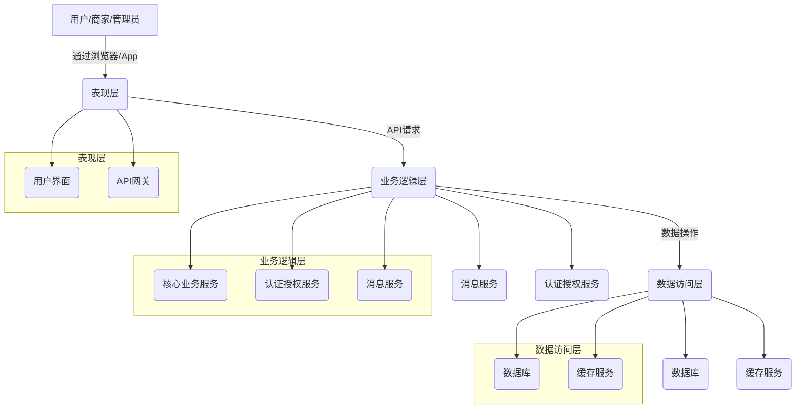
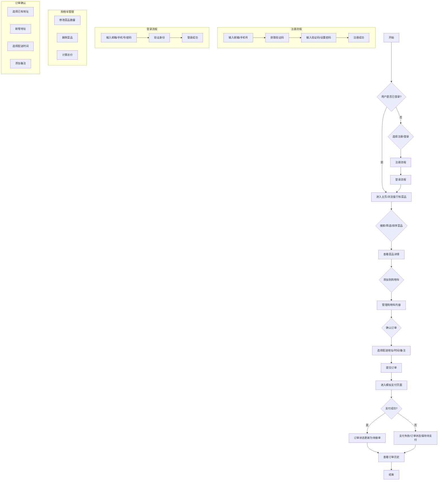
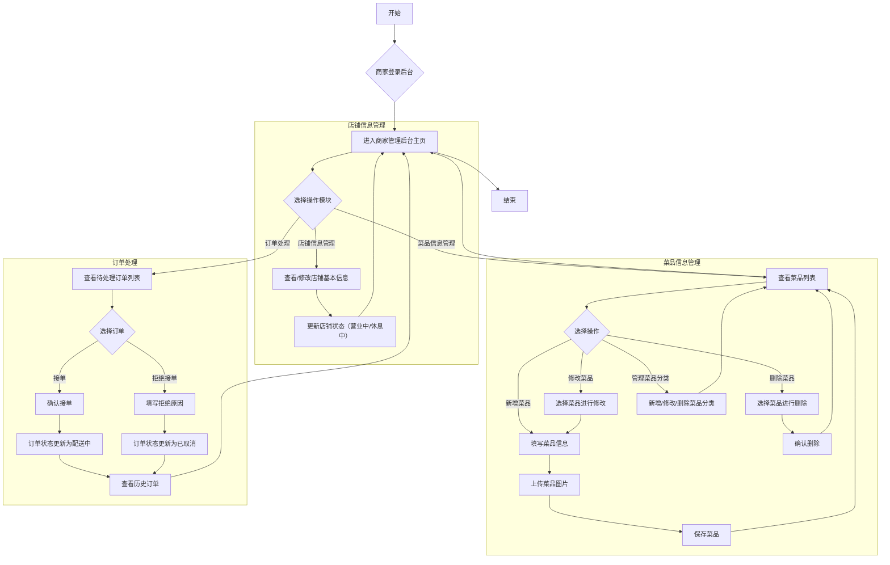
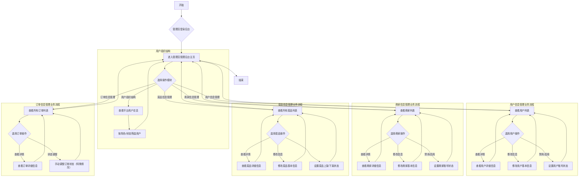

# 模拟外卖平台项目需求说明书

# 目录

1. 研发背景
2. 用户对象
3. 应用范围
4. 术语定义
5. 系统架构图
6. 业务流程
   6.1 用户端业务流程
   6.2 商家端业务流程
   6.3 管理员端业务流程
      6.3.1 用户组织结构
      6.3.2 用户信息管理业务流程
      6.3.3 商家信息管理业务流程
      6.3.4 菜品信息管理业务流程
      6.3.5 订单信息管理业务流程

7. 软件需求说明书
   7.1 用户端功能需求
   7.2 登录注册模块与用户端订单管理功能需求说明
      7.2.1 菜品浏览与搜索功能需求说明
      7.2.2 购物车功能需求说明
      7.2.3 下单与支付功能需求说明
      7.2.4 个人中心功能需求说明
   7.3 商家端功能需求说明
   7.4 管理员端功能需求说明
      7.4.1 用户信息管理功能需求说明
      7.4.2 商家信息管理功能需求说明
      7.4.3 菜品信息管理功能需求说明
      7.4.4 订单信息管理功能需求说明

8. 性能需求
9. 可靠性需求

## 1. 研发背景

随着互联网技术的飞速发展和智能手机的普及，在线外卖平台已成为现代生活中不可或缺的一部分，深刻改变了人们的餐饮消费习惯。外卖平台通过整合餐饮商家、配送服务和用户需求，构建了一个高效便捷的餐饮生态系统。其核心业务流程涵盖了用户下单、商家接单、骑手配送、在线支付以及订单管理等多个环节，涉及前端界面交互、后端数据处理、数据库设计、API接口通信、并发处理、安全机制等诸多计算机科学与技术领域的关键知识点。

本项目旨在为高校计算机相关专业（如软件工程、计算机科学与技术、网络工程、信息管理与信息系统等）的课程实训提供一个功能完备、业务流程清晰的模拟外卖平台。通过参与本项目的开发，学生能够将课堂上学习到的软件工程理论、数据库原理、网络编程、Web开发技术等知识应用于实际场景，亲身体验从需求分析、系统设计、编码实现到测试部署的全过程。这不仅有助于学生巩固专业基础知识，更重要的是能够提升其解决实际问题的能力、团队协作能力以及工程实践素养，为未来从事软件开发、系统架构等相关工作打下坚实的基础。

本模拟外卖平台项目聚焦于实现一个典型电商/生活服务类应用的核心业务流程和技术模块，旨在提供一个可操作、可扩展的实践平台，使学生能够深入理解并掌握现代软件开发的完整生命周期。通过对用户系统、菜品与商家模块、订单流程等核心功能的模拟实现，学生将有机会接触并实践如用户认证与授权、数据持久化、事务管理、并发控制、接口设计等关键技术，从而全面提升其全栈开发能力和工程素养，更好地适应行业发展对复合型人才的需求。

## 2. 用户对象

本模拟外卖平台主要面向以下三类用户对象：

### 2.1. 学生用户（普通消费者）

**特征：**
- 具备基本的计算机操作能力，熟悉互联网应用。
- 主要通过移动设备或PC浏览器访问平台。
- 关注菜品种类、价格、配送速度、商家信誉等。
- 期望操作流程简单、界面友好、响应迅速。

**主要需求：**
- 浏览和搜索各类餐厅及菜品。
- 查看菜品详情、价格、评价等信息。
- 将心仪的菜品加入购物车，并管理购物车内容。
- 选择配送地址和时间，提交订单。
- 进行模拟支付操作。
- 查询个人订单历史和订单状态。
- 管理个人信息和收货地址。

### 2.2. 模拟商家（餐厅经营者）

**特征：**
- 具备一定的后台管理系统操作经验。
- 主要通过PC浏览器访问后台管理界面。
- 关注店铺信息和菜品信息的管理效率。
- 期望能够及时接收和处理用户订单。

**主要需求：**
- 登录商家后台管理系统。
- 管理和更新店铺的基本信息，如店铺名称、介绍、公告、营业时间等。
- 管理菜品分类，包括新增、修改、删除分类。
- 管理菜品信息，包括新增、修改、删除菜品，设置菜品价格、图片、描述、库存等。
- 查看待处理订单，并进行接单、拒绝等操作。
- 查看历史订单和订单统计信息。

### 2.3. 管理员（平台运营及维护人员）

**特征：**
- 具备较高的计算机操作和系统管理能力。
- 主要通过PC浏览器访问平台管理后台。
- 关注平台整体运营状况、数据统计、用户和商家管理、系统安全等。

**主要需求：**
- 登录管理员后台管理系统。
- 管理平台所有注册用户的信息，包括查询、修改、禁用等。
- 管理平台所有注册商家信息，包括审核、修改、禁用等。
- 监控平台订单数据，进行异常订单处理。
- 管理菜品分类和平台通用配置。
- 查看系统运行日志和性能指标。
- 进行数据备份和恢复操作（可选）。

## 3. 应用范围

本模拟外卖平台项目主要应用于高校计算机相关专业的课程实训、毕业设计或相关技术竞赛。其应用范围具体包括但不限于以下几个方面：

- **课程实践教学：** 作为软件工程、数据库原理、Web开发技术、计算机网络等课程的实践教学案例，学生可以通过实际参与项目的开发，将理论知识与实践相结合，加深对所学知识的理解和掌握。
- **全栈开发能力培养：** 项目涵盖前端界面开发、后端逻辑实现、数据库设计与管理、API接口开发与调用等多个技术层面，有助于培养学生的全栈开发能力。
- **工程素养提升：** 通过模拟真实软件项目的开发流程，包括需求分析、系统设计、编码实现、测试与部署，提升学生的工程实践能力、项目管理能力和团队协作能力。
- **技术栈学习与探索：** 学生可以在项目开发过程中，学习和掌握当前主流的Web开发技术栈，如前端框架（React, Vue, Angular）、后端语言（Python, Java, Node.js）、数据库（MySQL, PostgreSQL, MongoDB）等，并可根据自身兴趣进行技术选型和深入探索。
- **毕业设计与创新项目：** 本项目可作为学生毕业设计的基础框架，学生可以在此基础上进行功能扩展、性能优化或引入新的技术（如人工智能、大数据分析等），形成具有创新性的个人项目。
- **技术能力评估：** 教师可以通过学生的项目实现情况，评估其对相关技术知识的掌握程度和实际开发能力。

尽管本项目是一个模拟平台，但其核心业务逻辑和技术架构均参照真实外卖平台设计，因此，学生在本项目中获得的经验和技能，可以直接迁移到实际的商业项目开发中，为他们未来的职业发展奠定坚实的基础。

## 4. 术语定义

为确保本文档的清晰性和一致性，特定义以下术语：

- **用户 (User):** 指在本平台上注册并使用其服务的普通消费者，主要是指参与课程实训的学生。用户可以浏览菜品、下单、支付、管理个人信息等。
- **商家 (Merchant):** 指在本平台上注册并提供餐饮服务的模拟商家或餐厅。商家可以在后台管理店铺信息、菜品信息、处理订单等。
- **管理员 (Administrator):** 指负责本平台整体运营、维护和管理的人员。管理员拥有最高权限，可以管理用户信息、商家信息、订单数据、系统配置等。
- **菜品 (Dish/Item):** 指商家在平台上展示和销售的食品或商品。
- **购物车 (Shopping Cart):** 用户在下单前临时存放所选菜品的虚拟容器，可以对其中的菜品进行增、删、改等操作。
- **订单 (Order):** 用户确认购买购物车中的菜品后生成的交易记录，包含菜品信息、配送地址、支付状态等。
- **CRUD:** Create, Read, Update, Delete 的缩写，分别代表创建、读取、更新、删除四种基本的数据操作。
- **API (Application Programming Interface):** 应用程序编程接口，是前后端数据交互、系统与外部服务通信的桥梁，定义了不同软件组件之间交互的规则和协议。
- **系统架构 (System Architecture):** 描述系统组成、各组件之间的关系以及指导其设计和演化的原则和指南的蓝图。
- **业务流程 (Business Process):** 为达到特定业务目标而执行的一系列相关、结构化的活动或任务的集合。
- **会话管理 (Session Management):** 在用户登录后，服务器为用户创建一个会话（Session），用于在后续的请求中识别用户身份，保持登录状态。
- **支付模拟 (Payment Simulation):** 模拟真实支付流程，用于测试订单支付功能，不涉及真实资金交易。

## 5. 系统架构图

本模拟外卖平台将采用经典的三层架构（或多层架构）设计，以实现模块化、高内聚、低耦合的目标，便于开发、维护和扩展。该架构将系统划分为表现层、业务逻辑层和数据访问层，各层之间职责明确，通过清晰的接口进行通信。

**系统架构概述：**

1.  **表现层 (Presentation Layer)：**
    *   **用户界面 (User Interface)：** 负责与用户直接交互，包括Web页面（PC端和移动端自适应）和可能的移动应用界面。主要技术栈可选用主流前端框架（如React, Vue, Angular）结合HTML5、CSS3和JavaScript。
    *   **API网关 (API Gateway)：** 作为所有客户端请求的统一入口，负责请求路由、负载均衡、认证授权、限流熔断等功能。在简化项目中，此部分功能可由后端服务直接承担。

2.  **业务逻辑层 (Business Logic Layer)：**
    *   **核心业务服务 (Core Business Services)：** 包含平台的核心业务逻辑，如用户管理、商家管理、菜品管理、购物车管理、订单管理、支付处理等。这些服务将处理来自表现层的请求，并协调数据访问层进行数据操作。可选用Python (Flask/Django)、Java (Spring Boot)、Node.js (Express) 等后端技术栈。
    *   **认证授权服务 (Authentication & Authorization Service)：** 负责用户身份验证（登录、注册）和权限管理，确保只有合法用户才能访问受保护的资源。
    *   **消息服务 (Messaging Service)：** 用于处理异步任务，如订单状态通知、邮件/短信验证码发送等，提高系统响应速度和吞吐量。在简化项目中，可直接通过同步调用实现。

3.  **数据访问层 (Data Access Layer)：**
    *   **数据库 (Database)：** 负责数据的持久化存储和管理。可选用关系型数据库（如MySQL, PostgreSQL）或NoSQL数据库（如MongoDB, Redis）根据具体需求。数据库设计将包括用户表、商家表、菜品表、订单表、地址表等。
    *   **缓存服务 (Caching Service)：** 用于存储频繁访问的数据，减少数据库负载，提高数据读取速度。例如，可使用Redis缓存热门菜品、商家信息等。

**系统架构图（示意）：**

**说明：**

-   **客户端：** 用户、商家和管理员通过Web浏览器或移动应用程序访问平台。
-   **前端：** 负责用户界面的呈现和用户交互逻辑。
-   **后端服务：** 包含所有业务逻辑和数据处理。
-   **数据库：** 存储所有业务数据。
-   **缓存：** 提高数据读取性能。
-   **消息队列：** 处理异步任务，解耦系统组件。

此架构设计旨在提供一个清晰、可扩展的框架，便于学生理解和实现各模块功能，并为后续的性能优化和功能扩展奠定基础。

## 6. 业务流程

本节将详细描述模拟外卖平台中用户、商家和管理员的主要业务操作流程，以图形和文字结合的方式展现各角色之间的交互和系统内部的处理逻辑。

### 6.1 用户端业务流程

用户端业务流程主要涵盖了用户从浏览菜品到完成订单的全过程，包括注册登录、菜品浏览、购物车管理、下单支付和订单查询等核心环节。以下是用户端的主要业务流程图及其详细说明：

**详细流程说明：**

1.  **开始与登录/注册：**
    *   用户启动应用或访问平台网站。
    *   系统判断用户是否已登录。如果已登录，则直接进入主页；如果未登录，则提示用户进行注册或登录。
    *   **注册流程：** 用户输入邮箱或手机号，获取验证码，输入验证码并设置密码完成注册。
    *   **登录流程：** 用户输入注册时的邮箱/手机号和密码，系统验证通过后登录成功。

2.  **浏览与选择菜品：**
    *   用户登录后进入平台主页，可以浏览推荐的餐厅和菜品。
    *   用户可以通过搜索框输入关键词（如菜品名称、餐厅名称）进行精确查找。
    *   用户还可以利用筛选功能（如菜品分类、价格区间、销量等）和排序功能（如按销量、价格、评价等）来缩小选择范围，找到符合需求的菜品。
    *   用户点击感兴趣的菜品，进入菜品详情页，查看菜品的详细信息，包括图片、描述、价格、评价等。

3.  **购物车管理：**
    *   在菜品详情页，用户可以选择菜品数量并将其“添加到购物车”。
    *   用户可以随时进入购物车页面，查看已添加的菜品列表。
    *   在购物车中，用户可以修改某个菜品的购买数量，也可以将不需要的菜品从购物车中删除。
    *   购物车会实时计算所有菜品的总价。

4.  **下单与支付：**
    *   用户确认购物车内容无误后，点击“确认订单”按钮，进入订单确认页面。
    *   在订单确认页面，用户需要选择配送地址（可以从已有的地址簿中选择，也可以新增地址）、选择配送时间（如立即配送或预约配送），并可以添加订单备注。
    *   确认所有信息无误后，用户点击“提交订单”按钮，系统生成订单并进入模拟支付页面。
    *   在模拟支付页面，用户点击“支付”按钮。系统模拟支付结果：
        *   **支付成功：** 订单状态更新为“待接单”。
        *   **支付失败：** 订单状态保持“待支付”，用户可以选择重新支付或取消订单。

5.  **订单查询：**
    *   用户可以随时进入“我的订单”页面，查看所有历史订单，包括待支付、待接单、配送中、已完成、已取消等不同状态的订单。
    *   用户可以点击具体订单查看订单详情，包括菜品列表、配送信息、支付信息等。
    *   对于未支付的订单，用户可以进行支付或取消操作。

整个用户端业务流程旨在提供一个流畅、直观的用户体验，确保用户能够便捷地完成从选择到接收外卖的整个过程。

### 6.2 商家端业务流程

商家端业务流程主要围绕商家如何管理店铺信息、菜品信息以及处理用户订单展开。以下是商家端的主要业务流程图及其详细说明：

**详细流程说明：**

1.  **商家登录：**
    *   商家通过专属的后台登录入口，输入账号和密码进行登录。
    *   系统验证身份后，商家成功进入管理后台主页。

2.  **选择操作模块：**
    *   商家登录后，可以在后台主页选择不同的管理模块，包括店铺信息管理、菜品信息管理和订单处理。

3.  **店铺信息管理：**
    *   商家进入店铺信息管理模块，可以查看当前店铺的名称、介绍、公告、营业时间、店铺图片等基本信息。
    *   商家可以修改这些信息，并更新店铺的营业状态（“营业中”或“休息中”）。
    *   修改完成后，保存并返回主页。

4.  **菜品信息管理：**
    *   商家进入菜品信息管理模块，可以查看所有已上架和下架的菜品列表。
    *   **新增菜品：** 商家点击“新增菜品”，填写菜品名称、所属分类、描述、价格、库存等信息，并上传菜品图片。保存后，新菜品将显示在菜品列表中。
    *   **修改菜品：** 商家选择需要修改的菜品，进入编辑页面，修改相应信息（如价格、描述、图片等），保存后更新菜品信息。
    *   **删除菜品：** 商家选择需要删除的菜品，系统会提示确认删除，确认后菜品将从列表中移除。
    *   **管理菜品分类：** 商家可以对菜品进行分类管理，包括新增、修改和删除菜品分类，以便更好地组织和展示菜品。
    *   操作完成后，返回菜品列表或主页。

5.  **订单处理：**
    *   商家进入订单处理模块，可以查看所有待处理（待接单）的用户订单列表。
    *   对于每一笔待处理订单，商家可以进行以下操作：
        *   **接单：** 商家确认可以制作并配送该订单，点击“接单”按钮。订单状态将自动更新为“配送中”，并通知用户。
        *   **拒绝接单：** 如果因特殊情况（如菜品售罄、商家休息等）无法完成订单，商家可以点击“拒绝接单”，并填写拒绝原因。订单状态将更新为“已取消”，并通知用户。
    *   商家还可以查看历史订单，了解已完成或已取消的订单详情。

通过以上流程，商家能够高效地管理自己的店铺和菜品，并及时响应用户订单，确保平台服务的正常运行。

### 6.3 管理员端业务流程

管理员端业务流程主要涉及平台整体的运营管理，包括用户、商家、菜品和订单等核心数据的维护与监控。管理员拥有最高权限，以确保平台的正常运行和数据安全。以下是管理员端的主要业务流程图及其详细说明：

**详细流程说明：**

1.  **管理员登录：**
    *   管理员通过专属的后台登录入口，输入账号和密码进行登录。
    *   系统验证身份后，管理员成功进入管理后台主页。

2.  **选择操作模块：**
    *   管理员登录后，可以在后台主页选择不同的管理模块，包括用户组织结构、用户信息管理、商家信息管理、菜品信息管理和订单信息管理。

3.  **用户组织结构：**
    *   管理员可以查看平台所有注册用户的总览，包括用户数量、活跃用户数等统计信息。
    *   可以根据用户角色（如普通用户、潜在用户等）或账号状态（如正常、禁用）进行筛选和查看。

4.  **用户信息管理业务流程：**
    *   管理员进入用户信息管理模块，可以查看所有注册用户的列表，包括用户ID、昵称、注册时间、联系方式、账号状态等。
    *   **查看详情：** 管理员可以点击特定用户，查看其详细信息，如地址簿、历史订单概要等。
    *   **修改信息：** 在必要时，管理员可以修改用户的基本信息（如昵称、联系方式），但敏感信息（如密码）通常不允许直接修改，只能重置。
    *   **禁用/启用：** 管理员可以根据平台规定，对违规用户进行账号禁用操作，或对已禁用的用户进行启用。

5.  **商家信息管理业务流程：**
    *   管理员进入商家信息管理模块，可以查看所有注册商家的列表，包括商家ID、店铺名称、入驻时间、联系方式、店铺状态等。
    *   **查看详情：** 管理员可以点击特定商家，查看其详细信息，如店铺介绍、菜品列表、订单统计等。
    *   **修改信息：** 管理员可以修改商家的基本信息，如店铺名称、联系方式、营业时间等。
    *   **禁用/启用：** 管理员可以对违规商家进行账号禁用操作，或对已禁用的商家进行启用。

6.  **菜品信息管理业务流程：**
    *   管理员进入菜品信息管理模块，可以查看平台上所有商家发布的菜品列表，包括菜品名称、所属商家、价格、销量、上架状态等。
    *   **查看详情：** 管理员可以查看菜品的详细信息，包括图片、描述、所属分类等。
    *   **修改信息：** 在必要时，管理员可以修改菜品的基本信息（如名称、价格、描述），主要用于纠正错误或进行平台层面的统一管理。
    *   **设置上架/下架状态：** 管理员可以对违规或不符合平台规定的菜品进行强制下架操作，或对符合规定的菜品进行上架。

7.  **订单信息管理业务流程：**
    *   管理员进入订单信息管理模块，可以查看平台所有订单的列表，包括订单号、下单用户、所属商家、订单金额、订单状态、下单时间等。
    *   **查看详情：** 管理员可以查看订单的详细信息，包括菜品列表、配送地址、支付状态、订单流转历史等。
    *   **状态调整：** 在特殊情况下（如系统异常、用户投诉等），管理员可能需要手动调整订单状态，例如将异常订单标记为已取消或已完成，但此类操作需谨慎并记录。

通过这些管理流程，管理员能够全面监控和管理平台的各项数据和运营活动，确保平台的健康、稳定运行。

## 7. 软件需求说明书

本节将详细阐述模拟外卖平台各模块的软件功能需求，包括用户端、商家端和管理员端。功能需求将以清晰、可验证的方式描述系统应提供的服务和行为。

### 7.1 用户端功能需求

用户端是普通用户与平台进行交互的主要界面，其功能设计应以用户体验为核心，确保操作的便捷性和直观性。用户端功能主要包括用户注册登录、个人信息管理、地址簿管理、餐厅及菜品浏览、搜索、筛选、排序、购物车管理、下单、支付以及订单历史查询等。

#### 7.2 登录注册模块与用户端订单管理功能需求说明

本模块是用户使用平台的基础，涵盖了用户身份的建立与管理，以及核心的订单生命周期管理。它确保了用户能够安全地访问平台，并顺利完成从选购到收货的整个流程。

##### 7.2.1 菜品浏览与搜索功能需求说明

**功能描述：** 用户能够方便地浏览平台上的餐厅和菜品，并通过多种方式（搜索、筛选、排序）快速找到目标菜品。

**详细需求：**

*   **FD-User-Browse-001：** 系统应提供餐厅列表展示功能，每个餐厅应显示名称、评分、销量、人均消费（可选）和主要菜品类别。
*   **FD-User-Browse-002：** 用户点击餐厅后，系统应展示该餐厅的详细信息页面，包括餐厅介绍、营业时间、联系方式以及该餐厅提供的所有菜品列表。
*   **FD-User-Browse-003：** 菜品列表应清晰展示菜品名称、图片、价格、月销量和简要描述。
*   **FD-User-Search-001：** 系统应提供全局搜索功能，用户可以通过输入菜品名称或餐厅名称进行模糊搜索。
*   **FD-User-Search-002：** 搜索结果应实时显示，并高亮匹配的关键词。
*   **FD-User-Filter-001：** 系统应提供菜品筛选功能，允许用户根据菜品分类（如主食、小吃、饮品）、价格区间、商家特色（如新店、品牌店）等条件进行筛选。
*   **FD-User-Sort-001：** 系统应提供菜品排序功能，允许用户根据销量从高到低、价格从低到高/从高到低、评价从高到低等维度进行排序。
*   **FD-User-Detail-001：** 用户点击菜品图片或名称，应能进入菜品详情页，查看菜品大图、详细描述、配料信息（可选）和用户评价。

**验收标准：**

*   用户能够成功浏览不同餐厅的菜品列表。
*   用户能够通过搜索框准确找到指定菜品或餐厅。
*   用户能够使用筛选和排序功能，并得到符合预期的结果。
*   菜品详情页能够完整展示菜品的所有相关信息。

##### 7.2.2 购物车功能需求说明

**功能描述：** 用户能够将选定的菜品加入购物车，并对购物车中的菜品进行管理，包括数量调整、删除和总价计算。

**详细需求：**

*   **FD-Cart-Add-001：** 用户在菜品详情页或菜品列表页点击“加入购物车”按钮时，选定的菜品应被添加到购物车中。
*   **FD-Cart-Add-002：** 如果购物车中已存在相同菜品，则应增加该菜品的数量而不是新增一条记录。
*   **FD-Cart-Update-001：** 用户应能在购物车页面修改单个菜品的购买数量（增加或减少）。
*   **FD-Cart-Remove-001：** 用户应能在购物车页面删除购物车中的某个菜品。
*   **FD-Cart-Calculate-001：** 购物车应实时显示当前所有菜品的总价，并随着菜品数量或种类的变化而自动更新。
*   **FD-Cart-Persistence-001：** 用户登录状态下，购物车内容应能持久化，即用户退出登录后再次登录，购物车内容应保持不变。
*   **FD-Cart-Empty-001：** 用户应能清空购物车。

**验收标准：**

*   菜品能够成功添加到购物车，并正确显示数量。
*   用户能够修改购物车中菜品的数量，并实时更新总价。
*   用户能够从购物车中删除菜品，并正确更新总价。
*   购物车总价计算准确无误。
*   用户登录后，购物车内容能够正确恢复。

##### 7.2.3 下单与支付功能需求说明

**功能描述：** 用户能够将购物车中的菜品生成订单，选择配送信息，并完成模拟支付。

**详细需求：**

*   **FD-Order-Generate-001：** 用户在购物车页面点击“去结算”或“提交订单”按钮后，系统应跳转至订单确认页面。
*   **FD-Order-Confirm-001：** 订单确认页面应清晰展示待下单的菜品列表、数量、单价、总价、配送费（可选）、包装费（可选）等费用明细。
*   **FD-Order-Address-001：** 用户应能在订单确认页面选择已有的收货地址，或新增收货地址。新增地址时需填写收货人姓名、联系电话、详细地址、门牌号等信息，并进行有效性验证。
*   **FD-Order-Time-001：** 用户应能在订单确认页面选择配送时间，包括“立即配送”和“预约配送”（可选，如选择具体时间段）。
*   **FD-Order-Remark-001：** 用户应能在订单确认页面添加订单备注，如“不要辣”、“多放香菜”等。
*   **FD-Order-Submit-001：** 用户确认所有信息无误后，点击“提交订单”按钮，系统应生成订单并跳转至模拟支付页面。
*   **FD-Payment-Simulate-001：** 模拟支付页面应显示订单金额，并提供“模拟支付成功”和“模拟支付失败”的选项。
*   **FD-Payment-Success-001：** 用户选择“模拟支付成功”后，订单状态应更新为“待接单”，并提示用户支付成功。
*   **FD-Payment-Fail-001：** 用户选择“模拟支付失败”后，订单状态应保持“待支付”，并提示用户支付失败，提供重新支付或取消订单的选项。
*   **FD-Order-Status-Update-001：** 订单状态应根据业务流程进行流转，包括：待支付、待接单、配送中、已完成、已取消、已退款等。

**验收标准：**

*   用户能够顺利从购物车进入订单确认页面，并显示正确的订单信息。
*   用户能够选择或新增配送地址，并成功保存。
*   用户能够选择配送时间并添加备注。
*   订单能够成功提交，并正确跳转到模拟支付页面。
*   模拟支付成功后，订单状态能够正确更新为“待接单”。
*   模拟支付失败后，订单状态能够正确保持“待支付”，并提供后续操作。

##### 7.2.4 个人中心功能需求说明

**功能描述：** 用户可以在个人中心管理自己的基本信息、地址簿和查看历史订单。

**详细需求：**

*   **FD-Profile-View-001：** 用户登录后，应能进入“个人中心”页面，查看自己的基本信息，如昵称、头像、注册手机号/邮箱等。
*   **FD-Profile-Edit-001：** 用户应能修改自己的昵称、头像、性别等个人信息。
*   **FD-Profile-Password-001：** 用户应能修改登录密码，修改时需验证旧密码。
*   **FD-Profile-Address-001：** 用户应能在个人中心管理地址簿，包括新增、修改、删除收货地址，并设置默认收货地址。
*   **FD-Profile-OrderHistory-001：** 用户应能在个人中心查看所有历史订单列表，包括订单号、下单时间、订单金额、订单状态等。
*   **FD-Profile-OrderDetail-001：** 用户点击历史订单列表中的任一订单，应能查看该订单的详细信息，包括菜品列表、配送信息、支付信息、订单流转记录等。
*   **FD-Profile-CancelOrder-001：** 对于处于“待支付”状态的订单，用户应能主动取消订单。
*   **FD-Profile-Reorder-001：** 用户应能对已完成的订单进行“再次购买”操作，将原订单中的菜品重新加入购物车（可选）。

**验收标准：**

*   用户能够成功进入个人中心，并查看个人信息。
*   用户能够修改个人信息和密码，并成功保存。
*   用户能够管理地址簿，包括增删改查和设置默认地址。
*   用户能够查看历史订单列表和订单详情。
*   用户能够取消待支付订单。

### 7.3 商家端功能需求说明

商家端是注册商家管理其店铺和处理订单的后台系统。其功能设计应注重操作的便捷性和管理的效率，确保商家能够高效地运营。商家端功能主要包括商家信息管理、菜品分类与信息管理、订单处理与管理等。

#### 7.3.1 商家信息管理功能需求说明

**功能描述：** 商家能够登录后台系统，并管理自己的店铺基本信息。

**详细需求：**

*   **FD-Merchant-Login-001：** 商家应能通过注册的账号和密码登录商家后台管理系统。
*   **FD-Merchant-Profile-View-001：** 商家登录后，应能查看自己的店铺基本信息，包括店铺名称、店铺介绍、店铺公告、营业时间、店铺图片、联系电话、店铺地址等。
*   **FD-Merchant-Profile-Edit-001：** 商家应能修改自己的店铺基本信息，并保存更新。
*   **FD-Merchant-Status-001：** 商家应能设置店铺的营业状态（“营业中”或“休息中”），并实时生效。
*   **FD-Merchant-Password-001：** 商家应能修改登录密码，修改时需验证旧密码。

**验收标准：**

*   商家能够成功登录商家后台。
*   商家能够查看并修改店铺信息，修改后信息能够正确更新。
*   商家能够正确设置店铺营业状态。

#### 7.3.2 菜品分类与信息管理功能需求说明

**功能描述：** 商家能够管理其店铺的菜品分类和具体的菜品信息。

**详细需求：**

*   **FD-Merchant-Category-Add-001：** 商家应能新增菜品分类，包括分类名称和排序。
*   **FD-Merchant-Category-Edit-001：** 商家应能修改已有菜品分类的名称和排序。
*   **FD-Merchant-Category-Delete-001：** 商家应能删除菜品分类，如果分类下有菜品，则需提示商家处理（如转移菜品或强制删除）。
*   **FD-Merchant-Dish-Add-001：** 商家应能新增菜品，包括菜品名称、所属分类、菜品图片、详细描述、价格、库存、单位（如份、杯）等信息。
*   **FD-Merchant-Dish-Edit-001：** 商家应能修改已有菜品的各项信息。
*   **FD-Merchant-Dish-Delete-001：** 商家应能删除菜品。
*   **FD-Merchant-Dish-Status-001：** 商家应能设置菜品的上架/下架状态。
*   **FD-Merchant-Dish-Search-001：** 商家应能通过菜品名称或分类搜索菜品。

**验收标准：**

*   商家能够成功管理菜品分类，包括增删改。
*   商家能够成功管理菜品信息，包括增删改和上下架。
*   菜品信息能够完整、准确地录入和展示。

#### 7.3.3 订单处理与管理功能需求说明

**功能描述：** 商家能够查看并处理用户提交的订单，并管理订单状态。

**详细需求：**

*   **FD-Merchant-Order-View-001：** 商家应能查看所有待处理（待接单）的订单列表，列表应显示订单号、下单时间、用户昵称、订单金额、菜品概览等信息。
*   **FD-Merchant-Order-Detail-001：** 商家点击订单后，应能查看订单详细信息，包括完整的菜品列表、数量、单价、用户配送地址、联系电话、配送时间、订单备注等。
*   **FD-Merchant-Order-Accept-001：** 商家应能对“待接单”状态的订单进行“接单”操作，接单后订单状态应自动更新为“配送中”。
*   **FD-Merchant-Order-Reject-001：** 商家应能对“待接单”状态的订单进行“拒绝接单”操作，并可填写拒绝原因。拒绝后订单状态应自动更新为“已取消”。
*   **FD-Merchant-Order-History-001：** 商家应能查看所有历史订单（已完成、已取消等），并可根据订单状态、时间范围进行筛选。
*   **FD-Merchant-Order-Notify-001：** 当有新订单生成时，系统应向商家发送通知（如声音提示、弹窗提示）。

**验收标准：**

*   商家能够及时收到新订单通知。
*   商家能够查看待处理订单列表和订单详情。
*   商家能够成功接单或拒绝订单，并正确更新订单状态。
*   商家能够查看历史订单。

### 7.4 管理员端功能需求说明

管理员端是平台运营和维护的核心，负责对整个平台的用户、商家、菜品和订单进行全面的管理和监控，确保平台的稳定运行和数据安全。管理员端功能主要包括用户信息管理、商家信息管理、菜品信息管理和订单信息管理。

#### 7.4.1 用户信息管理功能需求说明

**功能描述：** 管理员能够查看、搜索、修改和管理平台所有注册用户的信息。

**详细需求：**

*   **FD-Admin-User-View-001：** 管理员应能查看平台所有注册用户的列表，列表应显示用户ID、昵称、注册时间、联系方式（手机/邮箱）、账号状态（正常/禁用）等关键信息。
*   **FD-Admin-User-Search-001：** 管理员应能通过用户ID、昵称或联系方式搜索特定用户。
*   **FD-Admin-User-Detail-001：** 管理员点击用户后，应能查看该用户的详细信息，包括个人资料、地址簿列表、历史订单概要等。
*   **FD-Admin-User-Edit-001：** 管理员应能修改用户的基本信息（如昵称、联系方式），但敏感信息（如密码）应提供重置功能而非直接修改。
*   **FD-Admin-User-Status-001：** 管理员应能对用户账号进行禁用或启用操作，禁用后用户将无法登录和使用平台服务。
*   **FD-Admin-User-Export-001：** 管理员应能导出用户列表数据（可选）。

**验收标准：**

*   管理员能够成功查看、搜索用户列表。
*   管理员能够查看用户详细信息并进行修改。
*   管理员能够正确禁用和启用用户账号。

#### 7.4.2 商家信息管理功能需求说明

**功能描述：** 管理员能够查看、搜索、修改和管理平台所有注册商家（餐厅）的信息。

**详细需求：**

*   **FD-Admin-Merchant-View-001：** 管理员应能查看平台所有注册商家的列表，列表应显示商家ID、店铺名称、入驻时间、联系方式、店铺地址、营业状态（营业中/休息中）、账号状态（正常/禁用）等关键信息。
*   **FD-Admin-Merchant-Search-001：** 管理员应能通过商家ID、店铺名称或联系方式搜索特定商家。
*   **FD-Admin-Merchant-Detail-001：** 管理员点击商家后，应能查看该商家的详细信息，包括店铺介绍、营业执照信息（可选）、菜品列表概览、订单统计数据等。
*   **FD-Admin-Merchant-Edit-001：** 管理员应能修改商家的基本信息（如店铺名称、联系方式、店铺地址、营业时间等）。
*   **FD-Admin-Merchant-Status-001：** 管理员应能对商家账号进行禁用或启用操作，禁用后商家将无法登录后台和接收订单。
*   **FD-Admin-Merchant-Audit-001：** 管理员应能审核新入驻商家的资质（可选）。

**验收标准：**

*   管理员能够成功查看、搜索商家列表。
*   管理员能够查看商家详细信息并进行修改。
*   管理员能够正确禁用和启用商家账号。

#### 7.4.3 菜品信息管理功能需求说明

**功能描述：** 管理员能够查看、搜索、修改和管理平台所有商家发布的菜品信息。

**详细需求：**

*   **FD-Admin-Dish-View-001：** 管理员应能查看平台上所有菜品的列表，列表应显示菜品ID、菜品名称、所属商家、菜品分类、价格、库存、销量、上架状态等关键信息。
*   **FD-Admin-Dish-Search-001：** 管理员应能通过菜品名称、菜品ID或所属商家名称搜索特定菜品。
*   **FD-Admin-Dish-Detail-001：** 管理员点击菜品后，应能查看该菜品的详细信息，包括菜品图片、详细描述、所属分类、创建时间等。
*   **FD-Admin-Dish-Edit-001：** 管理员应能修改菜品的基本信息（如菜品名称、描述、价格、库存），主要用于纠正错误或进行平台层面的统一管理。
*   **FD-Admin-Dish-Status-001：** 管理员应能对菜品进行强制上架或下架操作，以应对违规菜品或平台运营策略调整。

**验收标准：**

*   管理员能够成功查看、搜索菜品列表。
*   管理员能够查看菜品详细信息并进行修改。
*   管理员能够正确设置菜品的上架/下架状态。

#### 7.4.4 订单信息管理功能需求说明

**功能描述：** 管理员能够查看、搜索、修改和管理平台所有订单的信息。

**详细需求：**

*   **FD-Admin-Order-View-001：** 管理员应能查看平台所有订单的列表，列表应显示订单ID、下单用户、所属商家、订单金额、下单时间、订单状态（待支付、待接单、配送中、已完成、已取消、已退款）等关键信息。
*   **FD-Admin-Order-Search-001：** 管理员应能通过订单ID、用户ID、商家ID、订单状态或下单时间范围搜索特定订单。
*   **FD-Admin-Order-Detail-001：** 管理员点击订单后，应能查看该订单的详细信息，包括完整的菜品列表、数量、单价、用户配送地址、联系电话、配送时间、订单备注、支付信息、订单流转历史等。
*   **FD-Admin-Order-Status-001：** 在特殊情况下（如用户投诉、系统异常等），管理员应能手动调整订单状态，但此操作需谨慎并记录操作日志。
*   **FD-Admin-Order-Export-001：** 管理员应能导出订单数据，用于数据分析或报表生成（可选）。

**验收标准：**

*   管理员能够成功查看、搜索订单列表。
*   管理员能够查看订单详细信息。
*   管理员能够在必要时手动调整订单状态。

## 8. 性能需求

性能需求描述了系统在特定负载下应具备的响应速度、吞吐量、并发处理能力和资源利用率等方面的要求。对于模拟外卖平台而言，良好的性能是确保用户体验和系统稳定运行的关键。

*   **PR-001：响应时间：**
    *   用户端：绝大部分页面加载和数据查询操作（如浏览菜品列表、查看菜品详情、提交订单）应在 **2秒** 内完成响应。
    *   商家端/管理员端：后台管理操作（如查询订单、管理菜品）应在 **3秒** 内完成响应。
    *   核心业务操作（如订单提交、支付结果反馈）应在 **1秒** 内完成响应。

*   **PR-002：并发用户数：**
    *   系统应能支持至少 **500个** 并发用户同时在线进行浏览、下单等操作，且系统响应时间不显著下降。
    *   在高峰期，系统应能处理至少 **100个** 并发下单请求。

*   **PR-003：吞吐量：**
    *   订单处理能力：系统应能支持每秒至少 **10笔** 订单的创建和处理。
    *   数据查询能力：系统应能支持每秒至少 **100次** 的菜品或餐厅信息查询请求。

*   **PR-004：资源利用率：**
    *   在正常负载下，CPU利用率应低于 **70%**，内存利用率应低于 **60%**。
    *   在高峰负载下，CPU利用率不应超过 **90%**，内存利用率不应超过 **80%**。

*   **PR-005：数据加载速度：**
    *   首页推荐菜品和餐厅列表应在 **1秒** 内完成加载。
    *   购物车页面加载应在 **0.5秒** 内完成。

*   **PR-006：稳定性：**
    *   系统应能在持续运行 **7x24小时** 的情况下，保持性能指标稳定，无明显性能衰退。

**验收标准：**

*   通过压力测试工具模拟并发用户和请求，验证系统在不同负载下的响应时间、吞吐量和资源利用率是否符合上述要求。
*   通过长时间运行测试，观察系统性能指标是否保持稳定。

## 9. 可靠性需求

可靠性需求描述了系统在规定条件下和规定时间内无故障运行的能力，以及在发生故障时能够恢复正常运行的能力。对于外卖平台而言，高可靠性是确保业务连续性和用户满意度的重要保障。

*   **RL-001：平均无故障时间 (MTBF)：**
    *   系统核心服务（如订单处理、支付服务）的平均无故障时间应达到 **99.9%**，即每年停机时间不超过8.76小时。
    *   非核心服务（如后台管理功能）的平均无故障时间应达到 **99%**，即每年停机时间不超过87.6小时。

*   **RL-002：平均恢复时间 (MTTR)：**
    *   当系统发生故障时，核心服务应在 **30分钟** 内恢复正常运行。
    *   非核心服务应在 **2小时** 内恢复正常运行。

*   **RL-003：数据完整性：**
    *   系统应确保所有业务数据（如用户数据、订单数据、菜品数据）的完整性和一致性，防止数据丢失或损坏。
    *   数据库应定期进行备份，并具备数据恢复能力。

*   **RL-004：容错性：**
    *   系统应具备一定的容错能力，当部分组件或服务发生故障时，不应导致整个系统崩溃，应能自动降级或切换到备用方案。
    *   关键模块应考虑冗余设计，如数据库主从复制、负载均衡等。

*   **RL-005：错误处理与日志记录：**
    *   系统应能捕获并处理各类异常和错误，避免程序崩溃。
    *   所有关键操作和异常信息都应详细记录在日志中，便于故障排查和问题分析。
    *   日志系统应具备日志轮转、归档和查询功能。

*   **RL-006：系统监控与告警：**
    *   系统应具备完善的监控机制，实时监测各项性能指标、服务状态和错误日志。
    *   当系统出现异常或达到预设阈值时，应能及时发出告警通知相关人员。

**验收标准：**

*   通过故障注入测试，验证系统在不同故障场景下的恢复能力和容错性。
*   检查日志记录的完整性和准确性。
*   验证监控告警系统是否能及时发现并通知异常。
*   定期进行数据备份和恢复演练，确保数据完整性。

